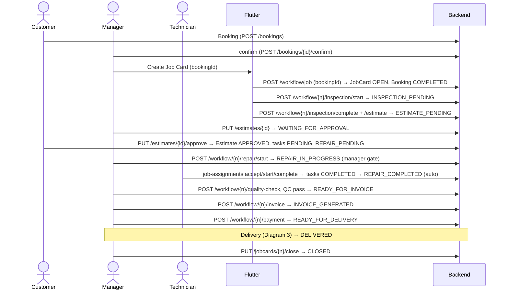
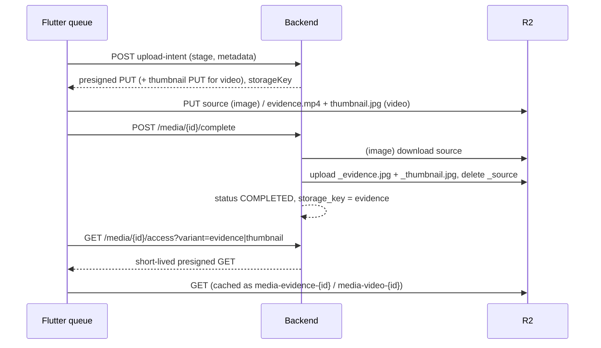
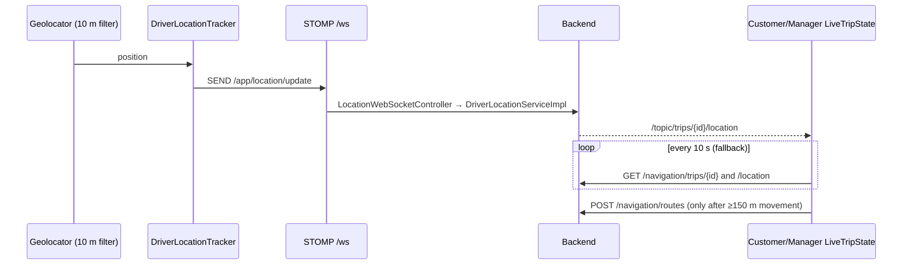

# GarageST Developer Handbook

Living engineering reference for GarageST (Flutter app + Spring Boot backend). It describes the system **as implemented** after the 2026-09-30 workflow + trip/navigation change. It never contains secrets — configuration is referred to by variable **name** only.

**Legend** — *Implemented* · *Legacy* (kept for compatibility, do not extend) · *Declared-only* (enum/column exists, nothing writes it) · *Not implemented* · *Config-dependent* · *Manual-only* (needs a device).

**Repos:** Flutter `D:\garagest_flutter` · Backend `D:\garageos-backend` · Production API `https://garagest-backend.onrender.com`.

Related documents: `GARAGEST_MEDIA_ARCHITECTURE.md` (media history/phases), `CLAUDE.md` (per-repo agent rules).

---

## Table of contents

1 Overview · 2 Repositories · 3 Stack · 4 System architecture · 5 Flutter architecture · 6 Backend architecture · 7 Security · 8 **Who owns the state** · 9 **State machines** · 10 JobCard vs RepairTask · 11 Approval vs manager confirmation · 12 Guided workflow engine · 13 **Service ownership table** · 14 **Coupling rules** · 15 Booking · 16 Pickup (deep) · 17 Delivery (deep) · 18 Delivery location · 19 Navigation · 20 OTP · 21 Trip ↔ Booking ↔ JobCard · 22 Customer journey · 23 Media · 24 Trip media vs JobCard media · 25 Database + V61 · 26 Flyway · 27 **API reference** · 28 WebSocket · 29 **Flutter screen/route map** · 30 **Key code paths (18)** · 31 **Sequence diagrams** · 32 Error handling · 33 Transaction boundaries · 34 Legacy matrix · 35 Deployment runbook · 36 Render / R2 / environment · 37 Testing + **test evidence** · 38 **Manual test matrix** · 39 **Debugging runbook** · 40 Architectural rules · 41 **ADRs** · 42 Change log · 43 How to maintain this handbook

---

## 1. Project Overview

GarageST runs a vehicle-service garage end to end: a customer books a service (optionally with pickup), the garage inspects, estimates, repairs, invoices and delivers; drivers move the vehicle with live navigation, OTP handover and photo evidence.

- **Users (roles):** Owner, Manager, Service Advisor, Technician, Driver, Accountant, Cashier, Customer (`RoleCode` on the backend, `UserRole` in Flutter; Flutter intentionally omits `SUPER_ADMIN`/`USER`).
- **Capabilities:** booking, job-card workflow (inspection → estimate → approval → repair → QC → invoice → payment → delivery), pickup and delivery trips with live map, OTP-verified handover, evidence photos/videos, customer portal with live vehicle journey.
- **Runtime:** Flutter (Android is the tested target; iOS parked) → REST `/api/v1` + STOMP `/ws` → Spring Boot → PostgreSQL. Media bytes go straight to Cloudflare R2. Hosting: Render (Docker).

## 2. Repository Structure

| Repo | Layout |
|---|---|
| Flutter | `lib/app` (composition root `app.dart`, `routes/`, splash) · `lib/core` (ApiClient, EnvConfig, secure storage, location/geocoding, utils) · `lib/features/<feature>/{models,services,screens,state,widgets}` · `lib/shared` · `android/app/src/main/kotlin/com/garagest/app` (`MainActivity`, `EvidenceVideoProcessor`) · `test/` mirrors `lib/` |
| Backend | `src/main/java/com/garageos/core` (enums, exceptions, security, audit base) · `modules/<module>/{controller,service(+impl),repository,entity,dto,mapper,validator}` · `src/main/resources/db/migration` (Flyway) · `Dockerfile` |

Flutter features that matter here: `workflow`, `jobcard`, `estimate`, `repair`, `booking`, `navigation`, `handover`, `media`, `customer_portal`, `auth`. Backend modules: `serviceworkflow`, `jobcard`, `estimate`, `estimateitem`, `repairtask`, `jobassignment`, `qualitycheck`, `invoice`, `delivery`, `booking`, `navigation`, `handover`, `media`, `customer`, `audit`, `identity`.

## 3. Technology Stack

Only technologies present in the code: **Java 17**, **Spring Boot 4.0.7** (web, security, data-jpa, websocket, validation), **PostgreSQL** + **Flyway** (`spring.jpa.hibernate.ddl-auto=validate`), springdoc-openapi, AWS SDK S3 client (Cloudflare R2), Google Drive client (legacy media), **Docker** (`eclipse-temurin:17-jdk`, builds with `./mvnw clean package -DskipTests`), **Render**. **Flutter** (Dart `>=3.3.0 <4.0.0`), `provider`, `flutter_map` + `latlong2`, `google_maps_flutter`, `geolocator`, `geocoding`, `stomp_dart_client`, `video_player`, `image_picker`, `cached_network_image`, `flutter_cache_manager`. Native Android video: **Media3 Transformer 1.4.1** (declared in `android/app/build.gradle.kts`). Routing: Google Routes (when configured) with OSRM fallback. **No Kafka** anywhere.

## 4. System Architecture

```
Flutter ──REST /api/v1 (Bearer JWT)──▶ Spring Boot ──JPA──▶ PostgreSQL
   │  └── STOMP  /ws  (/app/location/update, /topic/trips/{id}/location) ──▶ location relay
   ├── direct HTTPS PUT (presigned) ─────────────────────────▶ Cloudflare R2 (private bucket)
   └── Spring Boot ─▶ R2 (server-side evidence rendering)   Spring Boot ─▶ Google Routes / OSRM
```

**Responsibility split:** the backend owns business state, validation and authorization; Flutter renders that state and never invents it; R2 owns media bytes; PostgreSQL is the source of truth.

## 5. Flutter Architecture

- **Composition root:** `lib/app/app.dart` (`GarageSTApp`, one `MultiProvider`). Services take `ApiClient` in their constructor and are registered once; screens use `context.read/watch`. No screen constructs an `ApiClient`.
- **Routing:** `Routes.*` constants in `app/routes/app_routes_data.dart`; builders in `app/routes/app_router.dart`. Some screens are pushed directly (`TripEvidenceCaptureScreen`, `LocationPickerScreen`, `RegisterScreen`).
- **State:** `provider` only. `AuthState`, `WorkflowState` (deliberately a mutable bag — legacy JS port), `MediaUploadQueueService`, `LiveTripState`. Feature-local UI state stays in `StatefulWidget`s.
- **Personas:** splash redirect by role → `EmployeeHomeScreen` (Dashboard/Jobs/Customers/Vehicles tabs + "+ Workflow" FAB; technician/driver are role branches of the dashboard), `OwnerHome`, `CustomerHomeScreen`, `DriverHomeScreen`.
- **Session:** tokens in `SecureStorageService` only. Role gating in `Permissions` is presentation only (§7).

## 6. Backend Architecture

`Controller → Service (interface + Impl) → Repository → Entity`, DTOs + MapStruct mappers. Cross-module rules of thumb: a module writes its own aggregate's status; where several services write `JobCard.status` they all pass through `JobCardStatusValidator`. Orchestration lives in `ServiceWorkflowServiceImpl` (thin: it delegates to the owning services). Garage scoping is enforced in services, not only by URL.

## 7. Security

**Authentication:** JWT bearer (access token ~1 h, refresh ~7 d; configured under `security.jwt.*`). `/api/v1/auth/**`, `/api/v1/health/**` and static frontend paths are public (`SecurityConfig`); everything else needs authentication. Flutter never auto-refreshes (known gap, CLAUDE.md §5).

**Authorization layers (all server-side):**

| Layer | Where | Examples |
|---|---|---|
| Role | `@PreAuthorize` on controllers | `WORKFLOW/JOBCARD/DELIVERY/ASSIGNMENT_OPERATIONAL_ROLES` = MANAGER, SERVICE_ADVISOR, OWNER; `acceptInvoice` = CUSTOMER |
| Garage scoping | services | `JobCardServiceImpl.authorizeJobCardGarage`, `DeliveryServiceImpl.authorizeDeliveryAction`, `NavigationTripServiceImpl.requireOperationalStaffOfGarage`, `NavigationRequestServiceImpl` |
| **Manager gate** | `JobCardServiceImpl.authorizeProceedToRepair` (MANAGER only); `EstimateServiceImpl.authorizeEmployeeEstimateApproval` (MANAGER only, employee approval path) | repair start |
| Technician scope | `RepairTaskServiceImpl.authorizeRepairTaskAction` | technician may act only on their own non-cancelled assignment in their garage |
| Driver ownership | `NavigationTripServiceImpl.requireCallerIsDriver` / `getDriverTrip` | the `?driverId=` parameter must equal the authenticated user; driver must be an active DRIVER of the garage (`requireDriverOfGarage`) |
| Customer ownership | `HandoverServiceImpl`, `NavigationTripAccessGuard.authorizeViewer`, `EstimateServiceImpl.getOwnedCustomerEstimate`, portal services | not-found instead of forbidden, so existence is not leaked |
| OTP | `HandoverServiceImpl` | see §20 |
| Media | `R2MediaStorageProvider` | private bucket, short-lived presigned URLs, server-generated keys |

**What Flutter UI gating does NOT protect:** hiding a button (`Permissions.*`, `WorkflowStepDefinition.roles`, `allowedActions`) is cosmetic. Every rule that matters is re-checked by the backend; never rely on the UI to prevent an action. Several workflow endpoints have no `@PreAuthorize` and rely on service-level checks — do not assume a role check exists on a controller method without reading the service.

**Secrets:** environment variables only (§36). Known limitation: `application.properties` contains a default JWT secret value in source control, and `src/test/resources/application-test.properties` contains a local test DB password — move/rotate both (values are deliberately not reproduced here).

## 8. Who Owns the State

| State | Owner (only writer of record) | Authorization of the transition |
|---|---|---|
| `JobCard.status` | `JobCardServiceImpl` for most; also `EstimateServiceImpl` (`WAITING_FOR_APPROVAL`, `REPAIR_PENDING`), `RepairTaskServiceImpl`/`JobAssignmentServiceImpl.completeJob` (`REPAIR_COMPLETED`), `ServiceWorkflowServiceImpl.performQualityCheck` (`QUALITY_CHECK`), `QualityCheckServiceImpl`, `InvoiceServiceImpl`, `DeliveryServiceImpl` (`DELIVERED`). All call `JobCardStatusValidator.validate`. | per operation (§13) |
| `Estimate.status` | `EstimateServiceImpl` (`DRAFT`, `APPROVED`, `REJECTED`), `EstimateItemServiceImpl` (`WAITING_FOR_APPROVAL` when totals are recalculated) | customer owner for approve/reject |
| `RepairTask.status` | `RepairTaskServiceImpl`, `JobAssignmentServiceImpl` (start/complete of the linked task) | assigned technician or operational staff |
| `JobAssignment.status` | `JobAssignmentServiceImpl` (+ `RepairTaskServiceImpl.syncLinkedJobAssignment`) | assignee / assignment roles |
| `Booking.status` | `BookingServiceImpl`; `JobCardServiceImpl.createJobCard` sets `COMPLETED` | customer (cancel), staff (confirm/reject) |
| `NavigationRequest.status` | `NavigationRequestServiceImpl` (`REQUESTED`), `NavigationTripServiceImpl` (`ASSIGNED`, `IN_PROGRESS`, `COMPLETED`) | garage staff (assign), driver (start/complete) |
| `NavigationTrip.status/currentLeg/arrivedAt` | `NavigationTripServiceImpl` | the driver (`requireCallerIsDriver`) |
| `VehicleHandover.status` | `HandoverServiceImpl` | customer generates, driver verifies |
| `Delivery.status` | `DeliveryServiceImpl` (only `DELIVERED` is written) | operational roles (manual) or the driver's verified trip |
| workflow `completedSteps`/`nextStep`/`progress` | `ServiceWorkflowServiceImpl.getWorkflowStatus` (pure projection of `JobCardStatus`) | read-only |
| Flutter `currentStep` | `WorkflowController` (derives from backend `completedSteps`) | none — presentation |

## 9. State Machines

### 9.1 JobCard (`JobCardStatusValidator` is the single rule set)

| Current | Allowed next | Trigger / API | Actor | Owner method | Validation | Auto? |
|---|---|---|---|---|---|---|
| `OPEN` | `INSPECTION_PENDING`, `CANCELLED` | `POST /workflow/{n}/inspection/start` (Flutter chains it after create) | staff | `JobCardServiceImpl.startInspection` (via `ServiceWorkflowServiceImpl.startInspection`) | transition | manual (client chains) |
| `INSPECTION_PENDING` | `INSPECTION_COMPLETED`, `CANCELLED` | `POST /workflow/{n}/inspection/complete` (one request per complaint) | staff | `JobCardServiceImpl.completeInspection` | inspections count = complaints | manual |
| `INSPECTION_COMPLETED` | `ESTIMATE_PENDING`, `CANCELLED` | `POST /workflow/{n}/estimate` | staff | `JobCardServiceImpl.prepareEstimate` | transition | manual |
| `ESTIMATE_PENDING` | `WAITING_FOR_APPROVAL`, `CANCELLED` | `PUT /estimates/{id}` ("finish") | staff | `EstimateServiceImpl.updateEstimate` (only when job is `ESTIMATE_PENDING`) | transition | manual |
| `WAITING_FOR_APPROVAL` | `REPAIR_PENDING`, `CANCELLED` | `PUT /estimates/{id}/approve` | **customer** | `EstimateServiceImpl.approveEstimateCanonical` | ownership; estimate not already approved | manual (customer) |
| `REPAIR_PENDING` | `REPAIR_IN_PROGRESS`, `CANCELLED` | `POST /workflow/{n}/repair/start` (= `/jobcards/{n}/repair/start`) | **manager** | `JobCardServiceImpl.startRepair` | MANAGER role, estimate `APPROVED`, transition; idempotent | manual (**manager gate**) |
| `REPAIR_IN_PROGRESS` | `REPAIR_COMPLETED`, `CANCELLED` | last RepairTask completes | technician | `RepairTaskServiceImpl.completeRepair` / `JobAssignmentServiceImpl.completeJob` | all tasks `COMPLETED`; job must be `REPAIR_IN_PROGRESS` | **automatic** |
| `REPAIR_COMPLETED` | `QUALITY_CHECK`, `REPAIR_PENDING`, `CANCELLED` | `POST /workflow/{n}/quality-check` | manager/staff | `ServiceWorkflowServiceImpl.performQualityCheck` | transition | manual |
| `QUALITY_CHECK` | `READY_FOR_INVOICE`, `REPAIR_PENDING` (QC fail / rework) | `POST /jobcards/{n}/quality-check/pass` / `/fail` | staff | `QualityCheckServiceImpl` | QC body | manual |
| `READY_FOR_INVOICE` | `INVOICE_GENERATED`, `CANCELLED` | `POST /workflow/{n}/invoice` | staff | `InvoiceServiceImpl.generateInvoice` | transition | manual |
| `INVOICE_GENERATED` | `READY_FOR_DELIVERY`, `CANCELLED` | `POST /workflow/{n}/payment` | staff/customer | `InvoiceServiceImpl.receivePayment` | invoice accepted; customer ownership | manual |
| `READY_FOR_DELIVERY` | `DELIVERED`, `CANCELLED` | **delivery trip completion** (primary) or `POST /deliveries` (garage collection only) | driver / staff | `DeliveryServiceImpl.completeDeliveryFromTrip` / `createDelivery` | invoice `GENERATED` + `PAID`; see §17 | automatic on trip complete |
| `DELIVERED` | `CLOSED` | `PUT /jobcards/{n}/close` (`POST /workflow/{n}/close`) | operational roles | `JobCardServiceImpl.closeJobCard` | transition | manual |
| `CLOSED`, `CANCELLED` | — | terminal | | | | |

*Legacy source states* (never written by canonical code; kept so old rows can move forward): `ESTIMATE_APPROVED → REPAIR_PENDING`, `WORK_COMPLETED → READY_FOR_INVOICE`, `INVOICED/PAYMENT_PENDING/PAYMENT_COMPLETED → READY_FOR_DELIVERY`.
*Workflow projection* (`resolveCompleted`): see §12 — `APPROVAL` is completed only from `REPAIR_IN_PROGRESS` onward.

### 9.2 Estimate

| State | How reached | Written by |
|---|---|---|
| `DRAFT` | created empty by `EstimateServiceImpl.createEstimate(jobCardNumber)` | `EstimateServiceImpl` |
| `WAITING_FOR_APPROVAL` | estimate totals recalculated after items are added | `EstimateItemServiceImpl` |
| `APPROVED` | customer `PUT /estimates/{id}/approve` (or manager path `POST /workflow/{n}/estimate/approve`, UI disconnected) | `EstimateServiceImpl.approveEstimateCanonical` |
| `REJECTED` | customer `PUT /estimates/{id}/reject` | `EstimateServiceImpl.rejectEstimate` |
| `SENT_FOR_APPROVAL`, `EXPIRED` | *Declared-only* | — |

### 9.3 RepairTask

| State | Trigger | Actor | Notes |
|---|---|---|---|
| `PENDING` | created on customer approval (`RepairTaskServiceImpl.createRepairTasks`) | system | one per authorised estimate scope |
| `ASSIGNED` | `POST /job-assignments` (`JobAssignmentServiceImpl.assignJob`) | manager/SA/owner | |
| `IN_PROGRESS` | `PUT /job-assignments/{id}/start` or `PUT /repair-tasks/{id}/start` | assigned technician | **refused unless the JobCard is `REPAIR_IN_PROGRESS`** |
| `COMPLETED` | `PUT /job-assignments/{id}/complete` or `PUT /repair-tasks/{id}/complete` | assigned technician | requires JobCard `REPAIR_IN_PROGRESS`; when all done the job moves to `REPAIR_COMPLETED` |
| `ON_HOLD`, `CANCELLED` | *Declared-only* | | |

### 9.4 JobAssignment

`ASSIGNED → ACCEPTED (accept) → IN_PROGRESS (start) → COMPLETED (complete)`; `CANCELLED` via reassignment. `ON_HOLD`, `QC_PENDING`, `QC_FAILED`, `REWORK` are *Declared-only*. `startJob` requires `ACCEPTED` and (technician type) task `ASSIGNED` + job `REPAIR_IN_PROGRESS`, and **does not touch the JobCard**. `JobAssignmentType.DRIVER` is *Legacy* (§34).

### 9.5 Booking

`REQUESTED → CONFIRMED` (`confirmBooking`, creates the PICKUP request when pickup was asked) · `REQUESTED → REJECTED` · `REQUESTED/CONFIRMED → CANCELLED` (customer) · `CONFIRMED → COMPLETED` **only** when a Job Card is created with that `bookingId` (`JobCardServiceImpl.createJobCard`). Trip completion does not change the booking.

### 9.6 NavigationRequest

| State | Written when | By |
|---|---|---|
| `REQUESTED` | request created (booking confirm for PICKUP; `POST /navigation/requests` for DELIVERY) | `NavigationRequestServiceImpl.createRequest` |
| `ASSIGNED` | driver assigned | `NavigationTripServiceImpl.assignDriver` |
| `IN_PROGRESS` | `startTrip` | `NavigationTripServiceImpl.setRequestStatus` |
| `COMPLETED` | `completeTrip` | `NavigationTripServiceImpl.setRequestStatus` |
| `CANCELLED` | *Declared-only* (no cancel workflow) | — |

### 9.7 NavigationTrip

`ASSIGNED` (assignDriver) → `ACCEPTED` (`/accept`) → `IN_PROGRESS` (`/start`) → `COMPLETED` (`/complete`). Sub-state: `arrivedAt` (`/arrive`), `currentLeg` `GARAGE_TO_CUSTOMER → CUSTOMER_TO_GARAGE` (pickup only, `/continue`, which also resets `arrivedAt`). `CANCELLED` is *Declared-only*.

### 9.8 VehicleHandover

`PENDING` (customer generates code) → `VERIFIED` (driver verifies) · `PENDING → EXPIRED` (10 min, 5 failed attempts, or superseded by a new code). `CANCELLED` is *Declared-only*.

### 9.9 Delivery

Entity states declared: `PENDING`, `READY_FOR_DELIVERY`, `DELIVERED`. **Only `DELIVERED` is ever written** (`DeliveryServiceImpl.createDelivery` / `completeDeliveryFromTrip`). One `Delivery` row per JobCard and per Invoice (unique).

## 10. JobCard vs RepairTask

**JobCard = the overall vehicle/service lifecycle. RepairTask = one unit of repair work. RepairTask state must never be substituted for JobCard state.**

- Creation: RepairTasks appear when the customer approves (`createRepairTasks`, inside the approval transaction).
- Assignment: `JobAssignment` links a technician to a task (`assignJob`); RepairTask `PENDING → ASSIGNED`.
- Technician start/complete: only after the manager has moved the JobCard to `REPAIR_IN_PROGRESS`; both `JobAssignmentServiceImpl.startJob` and `RepairTaskServiceImpl.startRepair` throw *"A manager must proceed this Job Card to repair before a Repair Task can be started."* otherwise. Completing a task requires the job to be `REPAIR_IN_PROGRESS`.
- The only task→job coupling: when **every** task of the job is `COMPLETED`, the job becomes `REPAIR_COMPLETED` (validated). Task start never changes the job.
- QC failure sends the job back to `REPAIR_PENDING`; the manager must confirm again.

## 11. Customer Approval vs Manager Confirmation

**Customer approval does NOT equal manager confirmation.**

```
Customer approves → Estimate APPROVED → RepairTasks created → JobCard REPAIR_PENDING
        (Approval step still PENDING in the workflow projection)
Manager taps "Proceed to Repair" → POST /workflow/{n}/repair/start → JobCardServiceImpl.startRepair
        → JobCard REPAIR_IN_PROGRESS → Approval step COMPLETED → Repair is the next step
```

- Authoritative gate: `JobCardServiceImpl.startRepair` — `authorizeProceedToRepair` (MANAGER), estimate must be `APPROVED`, `JobCardStatusValidator` (`REPAIR_PENDING → REPAIR_IN_PROGRESS`); already-`REPAIR_IN_PROGRESS` returns the current state (idempotent).
- Entry points that converge on it: `POST /workflow/{n}/repair/start`, `POST /jobcards/{n}/repair/start`, Job Card screen action `start_repair` (hidden from non-managers by `JobCardProjectionServiceImpl`).
- The pending state is *not* a new JobCard status: it is `REPAIR_PENDING` interpreted by the projection (ADR-004).

## 12. Guided Workflow Engine

**Flutter:** `WorkflowShellScreen` (`_steps()`: search, job, inspection, completed [SA only], estimate, estimateItems, estimateSummary, approval, repair, quality, invoice, payment, delivery — 12 visible for a manager), `WorkflowStepDefinition(id, roles, screenBuilder)`, `WorkflowController`, `WorkflowState`, `WorkflowService`.

**Backend projection:** `GET /workflow/{n}/status` → `WorkflowStatusResponse{jobCardNumber, status, nextStep, progress, completedSteps}` from `ServiceWorkflowServiceImpl.getWorkflowStatus` (`resolveCompleted`, `resolveStep`, `resolveProgress`). `completedSteps` per job status (each row also contains everything above it):

| JobCard status | completedSteps adds |
|---|---|
| any | `CUSTOMER`, `VEHICLE`, `JOB_CARD` |
| `INSPECTION_COMPLETED`, `ESTIMATE_PENDING` | `INSPECTION` |
| `WAITING_FOR_APPROVAL` | `ESTIMATE`, `ESTIMATE_ITEMS`, `ESTIMATE_SUMMARY` |
| **`REPAIR_PENDING`, `ESTIMATE_APPROVED`** | *(nothing more — `APPROVAL` still pending)* |
| `REPAIR_IN_PROGRESS` | `APPROVAL` |
| `REPAIR_COMPLETED` | *(same; `REPAIR` intentionally not complete — manager reviews then proceeds to QC)* |
| `QUALITY_CHECK` | `REPAIR` |
| `READY_FOR_INVOICE` | `QUALITY_CHECK` |
| `INVOICE_GENERATED`… | `INVOICE` |
| `PAYMENT_COMPLETED`, `READY_FOR_DELIVERY` | `PAYMENT` |
| `DELIVERED`, `CLOSED` | `DELIVERY` |

`nextStep` uses the shell numbering (Approval 8, Repair 9, QC 10, Invoice 11, Payment 12, Delivery 13) and is informational; Flutter does **not** use it.

**Position derivation:** `WorkflowController._resolveCurrentStepFromCompletedSteps` picks the first *visible* step whose backend id (`_backendStepIdByLocalId`) is not in `completedSteps` (`search` is skipped once a job exists). It re-runs whenever `workflowStatus` changes (`_onWorkflowStateChanged`) or on `initializeFromWorkflowStatus()`.
**Rules for screens:** after a mutation that calls `refreshWorkflowStatus()`, do not call `nextStep()` (it double-advances) — call `initializeFromWorkflowStatus()` (see `EstimateSummaryScreen`, `ApprovalScreen`). Prefer `resumeWorkflow` when other actors (customer) may have changed data.
**Resume:** `WorkflowService.resumeWorkflow(n)` → `GET /workflow/{n}/resume` → `syncWorkflowState` (customer, vehicle, job, complaints, inspections, estimate + items, repair tasks, invoice). Entry points: "+ Workflow" FAB (`WorkflowState.reset()`, no API), Job Card "Resume Workflow"/navigate actions (argument = job number), **Booking → Create Job Card** (`WorkflowStartAtJobStep`: customer/vehicle/`bookingId` pre-loaded, starts on the Job Card step via `WorkflowController.goToStepById('job')`).
**Job Card detail screen** uses server-driven actions (`JobCardProjectionServiceImpl.allowedActions` → `JobCardActionService`); its actions call the same backend operations as the shell. *Navigate*-kind actions open the shell.
**Retained quirks (CLAUDE.md §11):** `WorkflowState.reset()` does not clear `workflowStatus/complaints/repairTasks/assignments`; `closeJob()`/`assignTechnician()` don't refresh status; the employee "Approve Estimate" button is disconnected. `WorkflowState.bookingId` (new) **is** cleared by `reset()`.

## 13. Backend Service Ownership

| Business operation | Controller | Service | Authoritative method | Entity | State written |
|---|---|---|---|---|---|
| Job creation | `ServiceWorkflowController.createJob` (`POST /workflow/job`) | `ServiceWorkflowServiceImpl` → `JobCardServiceImpl` | `createJobCard` | `JobCard`, `Complaint` | `OPEN`; Booking `COMPLETED`; pickup request `jobCardId` |
| Inspection start | `POST /workflow/{n}/inspection/start` | `ServiceWorkflowServiceImpl.startInspection` | `InspectionService.startInspection` + `JobCardServiceImpl.startInspection` | `Inspection`, `JobCard` | `INSPECTION_PENDING` |
| Inspection completion | `POST /workflow/{n}/inspection/complete` | `ServiceWorkflowServiceImpl.completeInspection(list)` (`@Transactional`) | `InspectionService.completeInspection` + `JobCardServiceImpl.completeInspection` | `Inspection`, `JobCard` | `INSPECTION_COMPLETED` |
| Estimate creation | `POST /estimates` (+ `POST /workflow/{n}/estimate` for job state) | `EstimateServiceImpl.createEstimate`; `JobCardServiceImpl.prepareEstimate` | same | `Estimate`(DRAFT) | `ESTIMATE_PENDING` |
| Estimate finish | `PUT /estimates/{id}` | `EstimateServiceImpl` | `updateEstimate` | `Estimate`, `JobCard` | `WAITING_FOR_APPROVAL` |
| Customer approval | `PUT /estimates/{id}/approve` | `EstimateServiceImpl` | `approveEstimate(Long)` → `approveEstimateCanonical` | `Estimate`, `RepairTask`, `JobCard` | Estimate `APPROVED`, tasks `PENDING`, job `REPAIR_PENDING` |
| **Manager repair confirmation** | `POST /workflow/{n}/repair/start`, `POST /jobcards/{n}/repair/start` | `JobCardServiceImpl` | `startRepair` | `JobCard` | `REPAIR_IN_PROGRESS` |
| Repair task start | `PUT /repair-tasks/{id}/start`, `PUT /job-assignments/{id}/start` | `RepairTaskServiceImpl`, `JobAssignmentServiceImpl` | `startRepair`, `startJob` | `RepairTask`, `JobAssignment` | task/assignment `IN_PROGRESS` (never the job) |
| Repair task completion | `PUT /repair-tasks/{id}/complete`, `PUT /job-assignments/{id}/complete` | same | `completeRepair`, `completeJob` | same + `JobCard` | task `COMPLETED`; job `REPAIR_COMPLETED` when all done |
| QC | `POST /workflow/{n}/quality-check`; `/jobcards/{n}/quality-check[/pass\|/fail]` | `ServiceWorkflowServiceImpl.performQualityCheck`; `QualityCheckServiceImpl` | `passQualityCheck`, `failQualityCheck` | `QualityCheck`, `JobCard` | `QUALITY_CHECK` → `READY_FOR_INVOICE` / `REPAIR_PENDING` |
| Invoice generation | `POST /workflow/{n}/invoice` | `InvoiceServiceImpl` | `generateInvoice` | `Invoice`, `JobCard` | `INVOICE_GENERATED` |
| Payment | `POST /workflow/{n}/payment` | `InvoiceServiceImpl` | `receivePayment` | `Invoice`, `JobCard` | invoice `PAID`; job `READY_FOR_DELIVERY` |
| Pickup request | `POST /bookings/{id}/confirm` | `BookingServiceImpl` → `NavigationRequestService` | `confirmBooking` | `Booking`, `NavigationRequest` | Booking `CONFIRMED`; request `REQUESTED` |
| Pickup trip | `POST /navigation/trips` + `/accept /start /arrive /continue /complete` | `NavigationTripServiceImpl` | `assignDriver … completeTrip` | `NavigationTrip`, `NavigationRequest` | §9.6–9.7 |
| Pickup handover | `GET/POST /navigation/trips/{id}/handover/*` | `HandoverServiceImpl` | `getOrCreateActiveCode`, `verify` | `VehicleHandover` | `PENDING`, `VERIFIED` |
| Pickup completion | `POST /navigation/trips/{id}/complete` | `NavigationTripServiceImpl.completeTrip` | same | trip, request | trip/request `COMPLETED` |
| Delivery request | `POST /navigation/requests?customerId=` | `NavigationRequestServiceImpl` | `createRequest` → `validateDeliveryRequest` | `NavigationRequest` | `REQUESTED` + `jobCardId`, address, coordinates |
| Delivery trip | `POST /navigation/trips` … | `NavigationTripServiceImpl` | as pickup | trip | as pickup (no return leg) |
| Delivery handover | `…/handover/*` | `HandoverServiceImpl` | as pickup, `direction=DELIVERY` | `VehicleHandover` | |
| Delivery completion | `POST /navigation/trips/{id}/complete` | `NavigationTripServiceImpl.completeTrip` → `DeliveryServiceImpl.completeDeliveryFromTrip` | same | `Delivery`, `JobCard`, trip, request | Delivery `DELIVERED`, job `DELIVERED` |
| Job delivery (manual) | `POST /deliveries` | `DeliveryServiceImpl` | `createDelivery` | `Delivery`, `JobCard` | same, only when no delivery request exists |
| Job closure | `PUT /jobcards/{n}/close`, `POST /workflow/{n}/close` | `JobCardServiceImpl` | `closeJobCard` | `JobCard` | `CLOSED` |

## 14. Workflow Coupling Rules

| Connection | Who calls whom | Trigger | State change | Auto/explicit | Transactional | Reversible |
|---|---|---|---|---|---|---|
| Job create → inspection start | Flutter `WorkflowService.createJob` → two REST calls | job created | `OPEN → INSPECTION_PENDING` | client-chained | **two** transactions (the create, then the start) | no |
| Inspection → estimate | Flutter `createEstimate` → `/inspection/complete` then `/estimate` | user taps Create Estimate | `→ INSPECTION_COMPLETED → ESTIMATE_PENDING` | client-chained | inspection+job atomic (`completeInspection`); estimate prep separate | no |
| Estimate → customer | `EstimateServiceImpl.updateEstimate` | manager finish | `→ WAITING_FOR_APPROVAL` | explicit | yes | no |
| Customer approval → repair pending | `EstimateServiceImpl.approveEstimateCanonical` → `RepairTaskServiceImpl.createRepairTasks`, `JobCardRepository` | customer approve | Estimate `APPROVED`, tasks, job `REPAIR_PENDING` | explicit (customer) | **one transaction** | no (no un-approve) |
| Manager confirm → repair | `JobCardServiceImpl.startRepair` | manager | `→ REPAIR_IN_PROGRESS` | **explicit manager** | yes | no |
| Task start/complete → job | `JobAssignmentServiceImpl` / `RepairTaskServiceImpl` | technician | task state; job `REPAIR_COMPLETED` on last task | explicit (task) / **automatic** (aggregate) | yes | no |
| QC fail → rework | `QualityCheckServiceImpl` | QC fail | job `REPAIR_PENDING` (manager must confirm again) | explicit | yes | yes (loop) |
| Payment → deliverable | `InvoiceServiceImpl.receivePayment` | payment | job `READY_FOR_DELIVERY` | explicit | yes | no |
| Booking confirm → pickup request | `BookingServiceImpl.confirmBooking` → `NavigationRequestService` | staff confirm | request `REQUESTED` | **automatic** on confirm when pickup requested | yes | via cancel (no request cancel) |
| Booking → job | `JobCardServiceImpl.createJobCard` (`resolveBooking`) | job created with `bookingId` | Booking `COMPLETED`; request `jobCardId` | explicit | yes | no |
| Driver assignment → trip | `NavigationTripServiceImpl.assignDriver` | staff | trip `ASSIGNED`; request `ASSIGNED` | explicit | yes (+ DB unique index backstop) | no |
| Trip start/complete → request | `NavigationTripServiceImpl.setRequestStatus` | driver | request `IN_PROGRESS`/`COMPLETED` | **automatic** | same transaction as the trip | no |
| Delivery trip complete → Delivery + job | `NavigationTripServiceImpl.completeTrip` → `DeliveryService.completeDeliveryFromTrip` | driver, after evidence + OTP | Delivery row, job `DELIVERED` | **automatic** | **one transaction** with the trip completion | no |
| Trip ↔ Workflow UI | none (Delivery screen buttons only) | — | — | — | — | — |
| Journey ← all | `CustomerVehicleJourneyServiceImpl` (read-only) | customer opens journey | none | derived | read-only | n/a |

## 15. Booking Architecture

`BookingController` (`/api/v1/bookings`): customer `POST`, staff `POST /phone` (operational roles), `GET /my`, `GET /garage`, `GET /{id}`, `POST /{id}/confirm|reject|cancel`. `BookingSource`: `CUSTOMER_APP`, `PHONE`. Confirm with `pickupRequested` builds a PICKUP `NavigationRequest` (address + coordinates copied) and stores `navigationRequestId`.
**Booking → Job Card:** `BookingDetailScreen` shows **Create Job Card** for staff when `canCreateJobCardFromBooking` (status `CONFIRMED` and either no pickup or its trip is `COMPLETED`; UI gate only). It preloads customer (`CustomerService.getById`) and vehicle (`VehicleRepository.getById`) into `WorkflowState`, sets `bookingId`, and pushes `Routes.employeeWorkflow` with `WorkflowStartAtJobStep`. `JobStepScreen` sends `CreateJobCardRequest.bookingId`. Backend `JobCardServiceImpl.resolveBooking` requires: booking exists, same garage (else not-found), `CONFIRMED`, same vehicle, customer matches vehicle owner, no other job already uses it. Then it sets `JobCard.bookingId`, Booking `COMPLETED`, and `NavigationRequest.jobCardId` of the booking's pickup request. Walk-in jobs omit `bookingId` and are unchanged.

## 16. Pickup Architecture (deep)

```
Booking(REQUESTED) ─confirm─▶ Booking(CONFIRMED) + NavigationRequest(PICKUP, REQUESTED)
 ─ staff "Assign Driver" (AssignDriverSheet → POST /navigation/trips) ─▶ Trip ASSIGNED, request ASSIGNED
 ─ driver Accept ─▶ Trip ACCEPTED ─ Start ─▶ Trip IN_PROGRESS (leg GARAGE_TO_CUSTOMER), request IN_PROGRESS
 ─ GPS stream + route to customer ─ "I Have Arrived" ─▶ arrivedAt set
 ─ 5 BEFORE_PICKUP photos (FRONT, REAR, LEFT, RIGHT, ODOMETER) ─ customer generates OTP ─ driver verifies ─▶ handover VERIFIED
 ─ "Start Return to Garage" ─▶ POST /continue: leg CUSTOMER_TO_GARAGE, arrivedAt=null, destinationAddress="GARAGE"
 ─ GPS + route to garage ─ "I Have Arrived" ─▶ arrivedAt set
 ─ "Complete Pickup Trip" ─▶ POST /complete: Trip COMPLETED, request COMPLETED
 ─ staff Create Job Card from the booking (job linked, booking COMPLETED, request.jobCardId set)
```

- **Completion preconditions** (`NavigationTripServiceImpl.completeTrip`, pickup): trip `IN_PROGRESS`; leg `CUSTOMER_TO_GARAGE` ("Pickup trip must return to garage before completion."); `arrivedAt != null` ("Mark arrival at the garage before completing the pickup trip."); all required `BEFORE_PICKUP` photos; verified PICKUP handover (re-checked defensively).
- **No garage-side OTP, by design:** custody transfer is confirmed once, at the customer (OTP + photos) before the return leg. At the garage there is no counter-party in the app to generate a code; the driver's arrival plus the earlier verified handover is the completion condition. `HandoverServiceImpl` therefore *refuses* code generation/verification for a pickup trip already on the return leg.
- **Return-leg destination detail:** the backend sets `destinationAddress` to the literal `"GARAGE"` and `NavigationTripResponse.destinationLatitude/Longitude` keep pointing at the customer's pickup coordinates. `ActiveTripScreen` resolves the real garage via `GET /garages/{id}` (`GarageService`, user's own `garageId`) and uses it for return-leg arrival/route. Anything else consuming a trip's destination on the return leg must do the same.
- **Driver UI:** `DriverDashboard._TripCard` renders `NavigationTrip.nextDriverAction` (`accept`, `start`, `arrive`, `evidenceAndHandover`, `completePickup`, `none`); `isPickupReturnLeg` = `tripType=='PICKUP' && currentLeg=='CUSTOMER_TO_GARAGE'`. `ActiveTripScreen` hides "View Confirmation Code" on the return leg.
- **Customer journey:** `DRIVER_ASSIGNED → DRIVER_EN_ROUTE → DRIVER_ARRIVED → EN_ROUTE_TO_GARAGE`; once the booking's job exists (request linked to job) the job-card stage takes over (§22).

## 17. Delivery Architecture (deep)

```
JobCard READY_FOR_DELIVERY
 → Delivery step (DeliveryScreen) restores state: GET /navigation/requests/job-card/{id}/delivery (404 = none)
 → "Request Delivery & Assign Driver": CreateDeliveryRequestSheet → LocationPickerScreen (map) → POST /navigation/requests?customerId=
      NavigationRequest(DELIVERY, jobCardId, deliveryAddress, deliveryLatitude, deliveryLongitude, REQUESTED)
 → AssignDriverSheet → POST /navigation/trips → Trip ASSIGNED, request ASSIGNED
 → driver Accept → Start → GPS/route to delivery coordinates → Arrive → 5 DELIVERY photos → customer OTP → driver verifies
 → POST /{trip}/complete:
      validateRequiredMedia(DELIVERY) + requireVerifiedHandover(DELIVERY)
      Trip COMPLETED; request COMPLETED
      DeliveryServiceImpl.completeDeliveryFromTrip(request.jobCardId, driverName, "Customer (OTP verified)")
          → Delivery(DELIVERED, deliveredBy, receivedBy) ; JobCard READY_FOR_DELIVERY → DELIVERED   (same transaction)
 → manager Close Job → CLOSED
```

- **Request rules** (`NavigationRequestServiceImpl.validateDeliveryRequest`): `jobCardId` required; address **and** both coordinates required; job in caller's garage and the request's garage; job `READY_FOR_DELIVERY`; request vehicle/customer must match the job's; no other non-cancelled DELIVERY request for the job. DB backstop: partial unique index (V61).
- **`completeDeliveryFromTrip` rules:** garage match; no existing Delivery; invoice found via `InvoiceRepository.findByEstimateJobCardId`; invoice `GENERATED` and `PAID`; then create Delivery and `JobCardStatusValidator` + set `DELIVERED`. Any failure rolls back the trip completion (same `@Transactional` boundary).
- **Why manual `POST /deliveries` still exists:** a customer who collects the car at the garage has no delivery trip. It is now **rejected** when any DELIVERY request exists for the job ("A delivery trip exists for this Job Card…") and when the invoice belongs to another job. The Delivery screen hides "Mark Vehicle Delivered (collected at garage)" once a request exists.
- **Delivery step UI states:** loading → *no request* (button "Request Delivery & Assign Driver") → `REQUESTED` ("Assign Delivery Driver") → `ASSIGNED/IN_PROGRESS` ("Track Delivery") → `COMPLETED` ("View Delivery"; job is `DELIVERED`, "Close Job" enabled). Returning from `ActiveTripScreen` calls `_refreshDelivery` (reload request + `resumeWorkflow`).
- **Legacy:** delivery requests created before V61 have `job_card_id = NULL`; their trip completes but touches no job.
- **Not implemented:** automatic driver selection, workload balancing, driver rejection, reassignment, delivery/trip cancellation.

## 18. Delivery Location

`CreateDeliveryRequestSheet` (bottom sheet, `show(context, customerId, vehicleId, garageId, jobCardId)`) offers **Select location on map** (pushes the existing `LocationPickerScreen` with `LocationPickerMode.delivery` and a `LocationSearchService`) and the older **current device location** shortcut (`PickupLocationProvider`). The picker returns a `PickupLocation{latitude, longitude, address?}`; the sheet fills coordinates and an editable address field. `resolveDeliveryAddress` keeps the address if present, otherwise `"<lat>, <lng>"` (6 decimals). Submit requires coordinates. `NavigationTripService.createDeliveryRequest` sends `requestType=DELIVERY, jobCardId, deliveryAddress, deliveryLatitude, deliveryLongitude, scheduledAt(now+2 min)`. Persistence: `navigation_request.delivery_address/latitude/longitude`; consumed by `NavigationTripServiceImpl.toResponse` as the trip destination for DELIVERY trips → `NavigationTrip.destinationLatitude/Longitude` → `ActiveTripScreen`/`LiveTripState` route.

## 19. Navigation Architecture

- **Driver GPS:** `DriverLocationTracker.start` — `Geolocator.getPositionStream`, high accuracy, **`distanceFilter: 10` m**, Android foreground-service notification. Started by `ActiveTripScreen._maybeStartDriverGps` for the driver; runs only while that screen is open.
- **Publish:** `LocationSocketService.publishLocation` → STOMP `/app/location/update` → `LocationWebSocketController` → `DriverLocationServiceImpl` (saves `DriverCurrentLocation`, appends `DriverLocationHistory` (`driver_location_history`), broadcasts via `SimpMessagingTemplate`).
- **Subscribe:** `/topic/trips/{tripId}/location` (customer, manager, driver), guarded by `TripLocationTopicInterceptor`. Socket: endpoint `/ws`, `reconnectDelay` 5 s, connection timeout 10 s, topics re-subscribed after reconnect.
- **REST fallback:** `LiveTripState` polls `GET /navigation/trips/{id}` every **10 s** (`_statusPollInterval`) and reads `GET /navigation/trips/{id}/location` when no recent socket fix.
- **Route:** `RouteService` → `POST /navigation/routes` (`RouteRequest{origin,destination}`) → `NavigationRouteServiceImpl`: Google Routes when configured (`GOOGLE_MAPS_ROUTES_API_KEY`), else OSRM. Recomputed only after the driver moved ≥ **150 m** since the last route (`_routeRecalculationDistanceMeters`).
- **Arrival:** the backend gate is the driver's `POST /arrive`; a 10 m GPS test (`kArrivalRadiusMeters`) drives only display labels.
- **Destination selection:** pickup outbound = request pickup coordinates; delivery = request delivery coordinates; pickup return leg = garage from `/garages/{id}` (§16). No coordinates → map shows the driver but no destination pin/route (`hasDestinationCoordinates`).
- **Screens:** `ActiveTripScreen` (driver/customer/manager), `ManagerFleetMapScreen` (`GET /navigation/trips/garage/{id}/fleet`), `DriverTripHistoryScreen`. Maps: `google_maps_flutter` on Android, `flutter_map` elsewhere.

## 20. OTP Architecture

`HandoverServiceImpl` (`VehicleHandover`, `V38`, `V39` = at most one pending per trip):

| Aspect | Behaviour |
|---|---|
| Generation | **customer** `GET /navigation/trips/{tripId}/handover/code` (`getOrCreateActiveCode`); allowed only if the caller owns the request, `trip.arrivedAt != null`, trip `IN_PROGRESS`, and the trip is not a pickup already on its return leg |
| Code | 6 digits, `SecureRandom`; only a `PasswordEncoder` hash (`code_hash`) is stored; audit events never include the code |
| Delivery to the driver | shown in the customer app, read out to the driver — not sent by SMS/e-mail |
| Expiry | 10 minutes (`EXPIRY_MINUTES`); requesting a new code marks the old pending one `EXPIRED` |
| Verification | **driver** `POST …/handover/verify` `{code}` (`VerifyHandoverRequest.code`); trip must be the driver's own and in the driver's garage; needs a `PENDING`, unexpired code |
| Attempts | `MAX_FAILED_ATTEMPTS = 5`; wrong code increments; at 5 the code is `EXPIRED` and a new one is needed |
| Direction | `direction = trip.tripType` (PICKUP or DELIVERY) — identical flow |
| Effects | `VERIFIED` + `verifiedAt/verifiedByDriverId`; audit `OTP_VERIFIED` and custody event. The trip does **not** move by itself: the driver presses "Start Return to Garage" (`continue`, pickup) or "Complete Delivery" (`complete`, delivery) in `HandoverVerifyScreen._advance` |
| Gate | `continueTrip` (pickup) and `completeTrip` (delivery; and pickup, re-checked) call `requireVerifiedHandover` |
| Status | `GET …/handover/status` (garage staff) returns latest handover |

## 21. Trip ↔ Booking ↔ JobCard Relationships

```
Booking ──navigationRequestId──▶ NavigationRequest(PICKUP) ──unique──▶ NavigationTrip ──▶ VehicleHandover
   │                                    │ jobCardId (set when the job is created from the booking)   └▶ NavigationTripMedia
   └── JobCard.bookingId ──▶ JobCard ◀──┘
                             ├─ Estimate ─ EstimateItem ─▶ RepairTask ─ JobAssignment
                             ├─ Invoice(estimate) ─▶ Delivery(jobCard 1:1, invoice 1:1)
                             └─ NavigationRequest(DELIVERY).jobCardId ──unique per live request──▶ NavigationTrip
```

The only reference added by the latest change is `navigation_request.job_card_id` (V61). Trips still have no direct FK to a JobCard; they reach it through their request. Vehicle-based heuristics remain only as a fallback in the customer journey.

## 22. Customer Journey Logic

`CustomerVehicleJourneyServiceImpl.getActiveJourneys()` (customer portal `GET /customer/vehicle-journeys/active`, screen `LiveVehicleJourneyScreen`). Per vehicle of the authenticated customer it batch-loads: latest **CONFIRMED booking**, latest **REQUESTED navigation request**, latest **ASSIGNED/ACCEPTED/IN_PROGRESS trip**, latest **non-`CLOSED/CANCELLED` job card** (note `DELIVERED` is still "active" and shows `COMPLETED`). Selection (`deriveStage`):

1. active trip → `deriveFromTrip` (`DRIVER_ASSIGNED`, `DRIVER_EN_ROUTE`, `DRIVER_ARRIVED`, `EN_ROUTE_TO_GARAGE` for pickup; `HANDOVER` for delivery);
2. else job card → `deriveFromJobCard` (`ARRIVED_AT_GARAGE`, `INSPECTION`, `ESTIMATE_PENDING`, `CUSTOMER_APPROVAL_REQUIRED`, `REPAIR_PENDING`, `REPAIR_IN_PROGRESS`, `QUALITY_CHECK`, `PAYMENT_PENDING`, `VEHICLE_READY`, `COMPLETED`);
3. else pending request → `BOOKING_CONFIRMED` ("arranging your pickup driver");
4. else confirmed booking → `BOOKING_CONFIRMED`.

**Direct-link rule (new):** if the active trip is a PICKUP whose `NavigationRequest.jobCardId` equals the vehicle's job card, the trip is ignored for stage selection (the vehicle is at the garage; the job card is the truth). A DELIVERY trip keeps priority (the customer must see the handover). Trips without the link (legacy, or before the job is created) keep the old "trip wins" behaviour.
**Edge cases:** a pickup trip left uncompleted and not yet linked still shows `EN_ROUTE_TO_GARAGE`; the vehicle-based selection can mis-pair records when a vehicle has overlapping active records; a stuck trip never auto-expires (no cancellation workflow).

## 23. Media Architecture

**Direct-to-R2, private bucket, presigned URLs. Spring never proxies media bytes; the old multipart limit was not raised.**

### New image
`MediaPickerSheet` (image_picker, optimized at pick) → capture metadata taken **at pick time** (`capturedAt`, one-shot GPS + reverse-geocoded address, sent with the offset via `isoWithLocalOffset`) → `MediaUploadQueueService.enqueue` (persistent queue) → `POST /job-cards/{id}/media/upload-intent` (`MediaServiceImpl.createUploadIntent`: row `evidence_only=true`, `captured_by` from the authenticated user, storage key `…_source.jpg`) → direct PUT → `POST /media/{id}/complete` → `MediaProcessingScheduler` (15 s poll) renders `…_evidence.jpg` (full resolution + footer: stage, captured time, captured-by, address, `Lat/Lng`, accuracy, GarageST) and `…_thumbnail.jpg` (320 px longest edge, from the evidence), sets `storage_key = evidence_key`, saves `COMPLETED`, **then** deletes the `_source` object. Retry: failures keep the row `UPLOADED`, `retry_count++`, `FAILED` after 5 (source kept); a lost save after rendering is detected and not re-rendered.

### New video
Pick/record → `MediaOptimizationService.renderEvidenceVideo` → Android `EvidenceVideoProcessor` (Media3 Transformer, **single pass**): reads rotation and computes the target in the video's own orientation (long edge ≤ 1920, short edge ≤ 1080, even dimensions, never squeezed into a landscape frame), bitrate = 80 % of the source (`qualityPercent = 80`, H.264/AAC MP4), draws the footer as a full-frame bitmap overlay, then extracts a JPEG (≤ 480 px longest edge) from the **finished** file → upload intent (returns two presigned URLs: `…_evidence.mp4`, `…_thumbnail.jpg`) → PUT both → `/complete {thumbnailUploaded:true, durationSeconds}` (backend verifies the thumbnail object exists). Evidence text is built on-device from persisted queue-item metadata (`buildEvidenceLines`) and mirrors `MediaEvidenceText` on the backend (same literals asserted in both test suites). Local outputs live in `<temp>/media_optimized/{localId}.mp4|.jpg`, are re-used on retry (never re-rendered once the paths are persisted), deleted after completion, and orphans are swept at app start. A crashed render restarts from the untouched original.

### Keys, access, cache, TTL
- Key convention: `GarageST/{garageCode}/{jobCardNumber}/{stage}/{jobCardNumber}_{stage}_{seq}_{source|evidence|thumbnail}.{ext}` (`MediaKeys.derive`); sequence from `getNextSequence`; no per-media folders.
- Access: `GET /media/{id}/access?variant=evidence|thumbnail` (employee) and `GET /customer/jobcards/{n}/media/{id}/access` (customer). `evidence_only` rows always resolve to the evidence (also for a stale `original`), and an image still being processed is `available=false` — the staging source is never signed.
- TTL: upload URL `R2_UPLOAD_URL_TTL_MINUTES` (default 15), playback `R2_PLAYBACK_URL_TTL_MINUTES` (default 10).
- Flutter cache keys: `media-video-{mediaId}` (stable, never the URL), `media-evidence-{id}`, `media-thumb-{id}`.
- Failure model: `MEDIA_STORAGE_NOT_CONFIGURED` is non-retryable; network/5xx retry with backoff (30 s, 2 m, 5 m, 15 m, 30 m); an upload URL that expired is re-requested (which creates a new row — known pre-existing behaviour).
- **Legacy compatibility:** Google Drive rows (proxied `/content`), and R2 rows with original + thumbnail/evidence keep working; the `evidence` variant falls back to the stored original when no evidence exists. Nothing was migrated or deleted. R2 delete removes a row's storage, evidence and thumbnail objects.
- **There is no separate original asset for NEW media.**

## 24. Trip Media vs JobCard Media

`JobCardMedia` ≠ `NavigationTripMedia`.

| | JobCardMedia | NavigationTripMedia |
|---|---|---|
| Owner | a JobCard | a NavigationTrip |
| Storage | Cloudflare R2 (Drive for legacy) | server local disk (`LocalMediaStorageService`, `garageos.media.storage-path`) — *Config-dependent durability on Render* |
| Upload | presigned direct PUT + queue | multipart through Spring (`POST /navigation/trips/{id}/media`) |
| Processing | evidence footer + thumbnail | none |
| Metadata | captured-by/at, lat/lng, accuracy, address | shot type, stage, lat/lng, capturedBy/At |
| Purpose | inspection/repair evidence for the job | pickup/delivery condition evidence; required shot set gates trip continue/complete |
Intentionally separate; connect only by ids if ever needed. The latest change did not touch either.

## 25. Database Architecture

Key entities: `User`(garage, role) · `Garage` · `Customer` · `Vehicle` · `Booking`(customerId, vehicleId, garageId, navigationRequestId) · `JobCard`(garage, vehicle, customer, `bookingId`, status) · `Complaint` · `Inspection` · `Estimate`(jobCard) · `EstimateItem`(selected) · `RepairTask`(jobCard, jobAssignment) · `JobAssignment`(user, repairTask, type) · `QualityCheck` · `Invoice`(estimate 1:1) · `Delivery`(jobCard 1:1, invoice 1:1, deliveredBy, receivedBy) · `NavigationRequest`(customerId, vehicleId, garageId, requestType, pickup/delivery address + coordinates, **`jobCardId`**, status) · `NavigationTrip`(navigationRequestId unique, driverId, tripType, currentLeg, status, source/destinationAddress, accepted/started/arrived/completedAt) · `VehicleHandover`(tripId, direction, codeHash, status, expiresAt, failedAttempts) · `NavigationTripMedia` · `JobCardMedia`(evidence_only, storage/thumbnail/evidence keys, capture metadata) · `AuditEvent`.
`spring.jpa.hibernate.ddl-auto=validate`: an entity field without a migrated column fails startup.

### V61 — `V61__add_navigation_request_job_card_reference.sql`
- **Table:** `navigation_request`. **Column:** `job_card_id BIGINT`, **nullable**, no default. **No foreign-key constraint** (the entity stores a plain `Long`; V61 declares none); integrity is enforced in services.
- **Indexes:** `idx_navigation_request_job_card (job_card_id)`; and **partial unique** `idx_navigation_request_one_delivery_per_job ON navigation_request (job_card_id) WHERE request_type = 'DELIVERY' AND status <> 'CANCELLED' AND job_card_id IS NOT NULL`.
- **Why the partial index:** database backstop for "at most one live delivery request per job card", so two concurrent "request delivery" submissions cannot create two deliveries for one job. Cancelled requests and legacy rows (NULL) are excluded; PICKUP rows are excluded entirely.
- **Who requires `job_card_id`:** new DELIVERY requests (service-level, `validateDeliveryRequest`). PICKUP requests have it set later, when the job is created from their booking; otherwise NULL.
- **Legacy rows:** all NULL; they remain valid; their delivery trips complete without a job effect.
- **Rollback:** the column is additive and nullable, so an older backend build runs fine against the new schema (it ignores the column). The reverse is not true (new build on the old schema fails `validate`). To undo the schema, create **V62** that drops the index/column — never edit V61 once applied. Dropping the column loses the delivery↔job link.
- **Flyway:** applied automatically at application start (`spring.flyway.enabled=true`, `spring.flyway.locations=classpath:db/migration`) before JPA validation; recorded in `flyway_schema_history`.
- *Other schema changes in this line of work:* `V60` `job_card_media.evidence_only BOOLEAN NOT NULL DEFAULT FALSE`. (`V59`, `V58` are the earlier media migrations.)
- **Not verified here:** V61 was not executed against a PostgreSQL instance in this environment (*Environment required*).

## 26. Flyway Migrations

Location `src/main/resources/db/migration`, names `V{n}__snake_case_description.sql`, strictly increasing. **Never modify an applied migration.** New columns: nullable or with a default; prefer partial/unique indexes as backstops for service rules. Test on PostgreSQL (partial indexes are PostgreSQL syntax). Recent: V57 account deletion · V58 media provider fields · V59 media audit metadata · V60 media evidence flag · V61 navigation_request job reference.

## 27. API Reference (business-critical)

Base `/api/v1`. "Auth" lists the enforced restriction; *svc* = enforced in the service, not by annotation. Errors surface as `ApiException.message` in Flutter.

### Workflow — `ServiceWorkflowController` `/workflow`
| Method & path | Auth | Purpose / inputs | State change | Notable failures |
|---|---|---|---|---|
| `POST /job` | authenticated, garage user | create job (`CreateJobCardRequest`: vehicleId, odometer, complaints[], estimatedDeliveryDate, remarks, **bookingId?**) | `OPEN`; Booking `COMPLETED` if bookingId | "User is not associated with a garage."; booking rules (§15) |
| `POST /{n}/inspection/start` | authenticated (svc garage scope) | creates inspection rows | `INSPECTION_PENDING` | invalid transition |
| `POST /{n}/inspection/complete` | authenticated | body: one `CreateInspectionRequest` per complaint | `INSPECTION_COMPLETED` | size mismatch |
| `POST /{n}/estimate` | authenticated | prepare estimate stage | `ESTIMATE_PENDING` | invalid transition |
| `POST /{n}/estimate/approve` | MANAGER (svc) | employee-side approval (UI disconnected) | as customer approval | "Only a Manager can approve this estimate." |
| `POST /{n}/repair/start` | **MANAGER (svc)** | manager confirmation | `REPAIR_IN_PROGRESS` | "Only a Manager can proceed a Job Card to repair."; "Estimate must be customer-approved before repair can start."; invalid transition |
| `POST /{n}/repair/complete` | authenticated | *Legacy* check-only wrapper | none | — |
| `POST /{n}/quality-check` | M/SA/OWNER | start QC | `QUALITY_CHECK` | invalid transition |
| `POST /{n}/invoice`, `/invoice/accept` | M/SA/OWNER ; CUSTOMER | generate / accept | `INVOICE_GENERATED` | |
| `POST /{n}/payment` | M/SA/OWNER/CUSTOMER (customer ownership svc) | receive payment | invoice `PAID`, `READY_FOR_DELIVERY` | "Invoice must be accepted before payment can be received." |
| `POST /{n}/delivery` | authenticated | `readyForDelivery` (UI unused) | `READY_FOR_DELIVERY` | — |
| `POST /{n}/close` | M/SA/OWNER | close | `CLOSED` | invalid transition |
| `GET /{n}/status` | authenticated | `WorkflowStatusResponse` | none | |
| `GET /{n}/resume` | authenticated | full snapshot for `WorkflowState` | none | |
| `GET /{n}/repair-tasks` | authenticated | tasks | none | |

### JobCard — `JobCardController` `/jobcards`
`GET /{id}/view` (role-dependent projection: customer / technician / operational; `allowedActions`, `visibleSections`) · `POST /{n}/inspection/start|complete`, `/estimate/prepare`, `/estimate/approve`, **`/repair/start`** (same `startRepair`), `/quality-check`, `/quality-check/pass|fail` (M/SA/OWNER), `PUT /{n}/ready-for-delivery`, **`PUT /{n}/close`** (M/SA/OWNER).

### Estimate — `EstimateController` `/estimates`
`PUT /{id}` finish (staff; `ESTIMATE_PENDING → WAITING_FOR_APPROVAL`) · `PUT /{id}/approve` and `/reject` (**CUSTOMER owner only**; not-found otherwise; "Estimate is already approved.").

### Repair — `/repair-tasks`, `/job-assignments`
`PUT /repair-tasks/{id}/assign` (M/SA/OWNER) · `PUT /repair-tasks/{id}/start|complete` (assigned technician or operational staff) · `POST /job-assignments` (M/SA/OWNER) · `PUT /job-assignments/{id}/accept|start|complete` (the assignee) · `PUT /job-assignments/{id}/reassign` (M/SA/OWNER). Start/complete guards in §10.

### Booking — `/bookings`
`POST /` (customer) · `POST /phone` (M/SA/OWNER) · `GET /my`, `/garage`, `/{id}` · `POST /{id}/confirm|reject|cancel`. Job linkage is via `POST /workflow/job` `bookingId`, not a booking endpoint.

### Navigation — `/navigation`
| Method & path | Caller | Purpose | Key validation / state |
|---|---|---|---|
| `POST /requests?customerId=` | garage staff | create request (`CreateNavigationRequest`) | DELIVERY: §17 rules; PICKUP created by booking confirm |
| `GET /requests/{id}`, `/customer/{id}`, `/garage/{id}`, `/{id}/trip` | per svc | lookups | `/trip` restricted to customer/driver/garage staff |
| `GET /requests/job-card/{jobCardId}/delivery` | garage staff | rediscover a job's delivery request | 404 if none / other garage |
| `POST /trips` | garage staff | assign driver (`{navigationRequestId, driverId}`) | request `REQUESTED`; driver active DRIVER of the garage; unique trip per request → trip `ASSIGNED`, request `ASSIGNED` |
| `POST /trips/{id}/accept?driverId=` | that driver | | trip `ASSIGNED → ACCEPTED` |
| `POST /trips/{id}/start?driverId=` | that driver | | `ACCEPTED → IN_PROGRESS`; request `IN_PROGRESS` |
| `POST /trips/{id}/arrive?driverId=` | that driver | sets `arrivedAt` | trip `IN_PROGRESS` |
| `POST /trips/{id}/continue?driverId=` | that driver | pickup outbound → return leg | pickup only; outbound leg; required `BEFORE_PICKUP` photos; verified PICKUP handover |
| `POST /trips/{id}/complete?driverId=` | that driver | finish | pickup: return leg + arrival + photos + handover; delivery: photos + handover + `completeDeliveryFromTrip`; request `COMPLETED` |
| `GET /trips/{id}`, `/{id}/location` | customer owner / driver / garage staff (`NavigationTripAccessGuard`) | trip / last location | not-found otherwise |
| `GET /trips/driver/{id}`, `/driver/{id}/history`, `/garage/{id}/fleet` | driver (self) / garage staff | lists | |
| `POST /routes` | authenticated | route between two points | Google → OSRM fallback |
| `POST /trips/{id}/media`, `GET …/media`, `…/media/{stage}`, `…/media/{mediaId}/content` | driver upload; viewers | trip evidence | upload only `IN_PROGRESS` and after arrival |

### Handover — `/navigation/trips/{tripId}/handover`
`GET /code` (customer owner) · `POST /verify` `{code}` (driver) · `GET /status` (garage staff) · `POST /evidence-viewed` (customer). Rules §20.

### Delivery — `/deliveries`
`POST /` (M/SA/OWNER) `CreateDeliveryRequest{jobCardId, invoiceId, deliveredBy?, receivedBy?, remarks?}` — garage collection only; rejected if a delivery request exists, if the invoice isn't the job's, if invoice not `GENERATED`+`PAID`, or a Delivery already exists. Trip-driven completion has no endpoint of its own: it happens inside `POST /navigation/trips/{id}/complete`. `GET /deliveries/{id}`, `GET /deliveries` are lookups.

### Media
`POST /job-cards/{id}/media/upload-intent` (`UploadIntentRequest`: stage, contentType, fileSize, repairTaskId?, capturedAt, latitude, longitude, locationAccuracyMeters, locationName) → `UploadIntentResponse` (mediaId, uploadUrl, requiredHeaders, storageKey, uploadSessionId, **thumbnailUploadUrl/thumbnailRequiredHeaders for VIDEO**) · direct `PUT` to R2 · `POST /media/{id}/complete` (`uploadSessionId`, durationSeconds?, `thumbnailUploaded?`) idempotent · `GET /media/{id}/access?variant=` (employee) · `GET /customer/jobcards/{n}/media/{id}/access` (customer) · `GET /job-cards/{id}/media` · `PUT /job-cards/{id}/media/{mediaId}/visibility` · `DELETE /media/{id}` (privileged) · `POST /job-cards/{id}/media` (*Legacy* multipart). Failure: `MEDIA_STORAGE_NOT_CONFIGURED`.

## 28. WebSocket Architecture

`WebSocketConfig`: endpoint `/ws` (plain and SockJS, all origins), application prefix `/app`, simple broker `/topic`. Publish `/app/location/update` (`DriverLocationRequest`: driverId, tripId, lat/lng, speed, heading, accuracy). Subscribe `/topic/trips/{tripId}/location`. Authorization per subscription: `TripLocationTopicInterceptor` → `NavigationTripAccessGuard.authorizeViewer`. Client: `LocationSocketService` (singleton), 5 s reconnect, resubscribe on connect; if the socket is down `LiveTripState` keeps working through REST polling. The in-memory simple broker means a single backend instance (no external broker).

## 29. Flutter Screen / Route Map

| Screen | Route | Entered by / how | State consumed | API calls | Changes | Next |
|---|---|---|---|---|---|---|
| `EmployeeHomeScreen` | `/employee/home` | splash redirect (employee roles) | `Permissions`, dashboards | dashboard + job list services | `WorkflowState.reset()` on FAB | workflow shell |
| `WorkflowShellScreen` | `/employee/workflow` (arg: job number \| `WorkflowStartAtJobStep` \| none) | FAB, Job Card actions, Booking "Create Job Card" | `WorkflowController`, `WorkflowState` | `GET /workflow/{n}/resume` when resuming | step position | its step screens |
| `SearchScreen` | (shell step) | first step | `WorkflowState.customer/vehicle` | customer by mobile, vehicle by registration | sets customer/vehicle | Job Card step |
| `JobStepScreen` | (shell) | manager/SA | customer, vehicle, `bookingId` | `POST /workflow/job`, `/inspection/start`, media queue | creates job, uploads media (queue) | Inspection |
| `InspectionScreen` | (shell) | manager | complaints, job | inspection create | inspections | Estimate |
| `EstimateScreen` | (shell) | manager | inspections | `/inspection/complete`, `/estimate`, `POST /estimates` | estimate DRAFT | Estimate Items |
| `EstimateItemScreen` | (shell) | manager | estimate | estimate-item CRUD | items, totals | Summary |
| `EstimateSummaryScreen` | (shell) | manager | estimate, items | `PUT /estimates/{id}` | job `WAITING_FOR_APPROVAL` | Approval (via `initializeFromWorkflowStatus`) |
| **`ApprovalScreen`** | (shell) | manager | `estimate.status`, `workflowStatus.status` | pull-to-refresh: `GET /workflow/{n}/resume`; button: `POST /workflow/{n}/repair/start` | `REPAIR_IN_PROGRESS` | Repair (re-derived) |
| `RepairScreen` | (shell) | manager, technician | tasks, assignments | `/job-assignments/*`, `/repair-tasks`, `/workflow/{n}/quality-check` | assignments/tasks; job `REPAIR_COMPLETED` (auto) then QC | Quality Check |
| `QualityCheckScreen` | (shell) | manager/technician | job | QC pass/fail | `READY_FOR_INVOICE` / `REPAIR_PENDING` | Invoice |
| `InvoiceScreen` | (shell) | manager/accountant | estimate, invoice | `/workflow/{n}/invoice`, `/invoice/accept` | `INVOICE_GENERATED` | Payment |
| `PaymentScreen` | (shell) | manager/accountant/cashier | invoice | `/workflow/{n}/payment` | `READY_FOR_DELIVERY` | Delivery |
| **`DeliveryScreen`** | (shell) | manager | `workflowStatus`, `jobCardId`, invoice | `GET /navigation/requests/job-card/{id}/delivery`, `POST /deliveries` (collection), `PUT /jobcards/{n}/close` via `closeJob`, `resumeWorkflow` | request/assignment, delivered, closed | `Routes.activeTrip`, sheets |
| `JobCardDetailScreen` | `/job-card` (arg: id) | job lists | `JobCardView` | projection, `JobCardActionService`, media | transitions per action | workflow shell |
| **`BookingDetailScreen`** | `/booking/detail` (arg: id) | queue, my bookings, journey | booking + pickup trip | bookings, `getTripByRequest`, `CustomerService`, `VehicleRepository` | confirm/reject/cancel; loads customer/vehicle into `WorkflowState` | `AssignDriverSheet`, `Routes.activeTrip`, workflow shell (`WorkflowStartAtJobStep`) |
| **`DriverDashboard`** (in `DriverHomeScreen`) | `/driver/home` | splash (driver role) | trips (`nextDriverAction`) | `getMyTrips`, accept/start/arrive/**complete** | trip state | `TripEvidenceCaptureScreen`, `Routes.handoverVerify`, `Routes.activeTrip` |
| **`ActiveTripScreen`** | `/navigation/active-trip` (arg: tripId) | driver, customer, manager, booking, delivery step | `LiveTripState` (trip, location, route), garage | trip GET/poll, location, routes, STOMP, `/garages/{id}` | publishes driver GPS (driver) | `Routes.handoverCode` |
| `TripEvidenceCaptureScreen` | pushed directly (tripId, stage) | driver "Capture Evidence" | captured shot types | trip media GET/POST | trip media | back |
| `HandoverCodeScreen` | `/handover/code` (arg: tripId) | customer/`ActiveTripScreen` | trip | `GET …/handover/code` | pending handover | back |
| `HandoverVerifyScreen` | `/handover/verify` (arg: tripId) | driver "Confirm Handover" | trip | `POST …/handover/verify`, then `continue` (PICKUP outbound) or `complete` (DELIVERY) | handover `VERIFIED`, trip | back |
| `LocationPickerScreen` | pushed directly | `PickupLocationSelector`, `CreateDeliveryRequestSheet` | initial `PickupLocation` | place search, reverse geocode | none | pops `PickupLocation` |
| **`CreateDeliveryRequestSheet`** | bottom sheet | Delivery step | customer/vehicle/garage/job ids | `POST /navigation/requests` | delivery request | returns request id |
| `AssignDriverSheet` | bottom sheet | booking detail, delivery step | request id | `GET /users/drivers`, `POST /navigation/trips` | trip created | returns bool |
| `CustomerEstimateDetailScreen` | customer portal | customer estimate list | estimate | `GET` estimate, `PUT /estimates/{id}/approve|reject` | estimate `APPROVED`, job `REPAIR_PENDING` | refresh |
| `LiveVehicleJourneyScreen` | `/customer/vehicle-journey` | customer home | journey summaries | `GET /customer/vehicle-journeys/active` | none | `BookingDetailScreen`, `Routes.activeTrip` |
| `ManagerFleetMapScreen` | `/navigation/fleet-map` | manager | fleet | fleet endpoint | none | `Routes.activeTrip` |

## 30. Key Code Paths

Notation: *Flutter screen → service → endpoint → controller → service → entity/state*.

**1. Customer approval → manager confirmation.** BEFORE: `resolveCompleted` listed `APPROVAL` at `REPAIR_PENDING`, so the manager was moved to Repair. AFTER: `APPROVAL` only from `REPAIR_IN_PROGRESS`. Path: `CustomerEstimateDetailScreen` → `CustomerPortalService.approveEstimate` → `PUT /estimates/{id}/approve` → `EstimateController` → `EstimateServiceImpl.approveEstimate(Long)` → `approveEstimateCanonical` → `Estimate.APPROVED`, `createRepairTasks`, `JobCard.REPAIR_PENDING`. Manager: `ApprovalScreen._refresh` → `WorkflowService.resumeWorkflow` → `GET /workflow/{n}/resume` → `ServiceWorkflowServiceImpl.resumeWorkflow` → `WorkflowController.initializeFromWorkflowStatus` stays on Approval; `_proceedToRepair` → `WorkflowService.proceedToRepair` → `POST /workflow/{n}/repair/start` → `ServiceWorkflowServiceImpl.startRepair` → `JobCardServiceImpl.startRepair` → `JobCard.REPAIR_IN_PROGRESS` → refresh → step = Repair.

**2. Repair-start bypass prevention.** BEFORE: `JobAssignmentServiceImpl.startJob` set `REPAIR_PENDING → REPAIR_IN_PROGRESS` itself (no manager/estimate/validator). AFTER: it throws *"A manager must proceed…"* unless the job is `REPAIR_IN_PROGRESS`, and never writes the job. Path: `RepairScreen._startRepair` → `JobAssignmentService.start` → `PUT /job-assignments/{id}/start` → `JobAssignmentController` → `JobAssignmentServiceImpl.startJob` → task/assignment `IN_PROGRESS`. `RepairTaskServiceImpl.startRepair` had the same guard already.

**3. RepairTask completion.** BEFORE: precondition in `RepairTaskServiceImpl.completeRepair` was commented out. AFTER: job must be `REPAIR_IN_PROGRESS`. Path: `RepairScreen._completeRepair` → `PUT /job-assignments/{id}/complete` (or `/repair-tasks/{id}/complete`) → task `COMPLETED`; last task → `statusValidator.validate` + job `REPAIR_COMPLETED`.

**4. Booking → JobCard.** BEFORE: Flutter never sent `bookingId`. AFTER: `BookingDetailScreen._startJobCard` → `WorkflowState.bookingId` → `JobStepScreen` → `CreateJobCardRequest.bookingId` → `POST /workflow/job` → `JobCardServiceImpl.createJobCard`/`resolveBooking` → `JobCard.bookingId`, Booking `COMPLETED`, `NavigationRequest.jobCardId` (pickup).

**5. Pickup trip.** `BookingDetailScreen` → `AssignDriverSheet` → `NavigationTripService.assignDriver` → `POST /navigation/trips` → `NavigationTripController` → `NavigationTripServiceImpl.assignDriver` → `NavigationTrip(ASSIGNED)`, request `ASSIGNED`. Driver: `DriverDashboard` → `acceptTrip`/`startTrip`/`arriveAtDestination` → `/accept /start /arrive`.

**6. Pickup return completion.** BEFORE: no UI called `completeTrip` for pickup (the handover screen re-called `continue`). AFTER: `DriverDashboard._DriverAction` (return leg + arrived) → `_complete` → `NavigationTripService.completeTrip` → `POST /trips/{id}/complete` → `completeTrip` → trip + request `COMPLETED`.

**7. Pickup OTP.** `ActiveTripScreen` → `HandoverCodeScreen` → `GET …/handover/code` → `HandoverServiceImpl.getOrCreateActiveCode` → `VehicleHandover(PENDING, codeHash)`; driver `HandoverVerifyScreen` → `POST …/handover/verify` → `verify` → `VERIFIED`; `_advance` → `continue`.

**8. Trip ↔ JobCard linkage.** `navigation_request.job_card_id` set by `JobCardServiceImpl.createJobCard` (pickup) and `NavigationRequestServiceImpl.createRequest` (delivery); exposed as `NavigationRequestResponse.jobCardId` and `NavigationTripResponse.jobCardId` (`NavigationTrip.jobCardId` in Flutter).

**9. Delivery request.** `DeliveryScreen._assignDeliveryDriver` → `CreateDeliveryRequestSheet.show` → `NavigationTripService.createDeliveryRequest` → `POST /navigation/requests` → `NavigationRequestController` → `NavigationRequestServiceImpl.createRequest` → `validateDeliveryRequest` → `NavigationRequest(DELIVERY, REQUESTED, jobCardId, address, lat, lng)`.

**10. Delivery map selection.** `CreateDeliveryRequestSheet._selectOnMap` → `LocationPickerScreen(mode: delivery)` → `PickupLocation` → fields → `resolveDeliveryAddress`.

**11. Delivery driver assignment.** `DeliveryScreen` → `AssignDriverSheet` → `POST /navigation/trips` (same as pickup; request must be `REQUESTED`). The screen re-loads the request afterwards.

**12. Delivery navigation.** Driver `ActiveTripScreen` → `DriverLocationTracker` → STOMP → `LiveTripState` on customer/manager; destination = `trip.destinationLatitude/Longitude` (delivery coordinates).

**13. Delivery OTP.** As #7 with `direction = DELIVERY`; `HandoverVerifyScreen._advance` → `completeTrip`.

**14. Delivery evidence.** `DriverDashboard` → `TripEvidenceCaptureScreen(stage: 'DELIVERY')` → `TripMediaService.upload` → `POST /trips/{id}/media` → `NavigationTripMediaServiceImpl.upload` (trip `IN_PROGRESS`, arrived) → `completeTrip` → `validateRequiredMedia(DELIVERY)`.

**15. Delivery trip completion.** `HandoverVerifyScreen._advance` → `POST /trips/{id}/complete` → `NavigationTripServiceImpl.completeTrip` → `setRequestStatus(COMPLETED)`.

**16. Delivery → JobCard `DELIVERED`.** `completeTrip` → `deliveryService.completeDeliveryFromTrip(jobCardId, driverName, "Customer (OTP verified)")` → `Delivery(DELIVERED)`, `JobCard.DELIVERED`.

**17. Customer journey.** `LiveVehicleJourneyScreen` → `GET /customer/vehicle-journeys/active` → `CustomerVehicleJourneyServiceImpl.getActiveJourneys` → linked-pickup rule (§22).

**18. Workflow resume/state restoration.** Job Card "Resume Workflow" / dashboard → `Routes.employeeWorkflow(jobNumber)` → `WorkflowShellScreen._resume` → `resumeWorkflow` → `syncWorkflowState` → `initializeFromWorkflowStatus`. The Delivery step additionally restores its request from the backend.

## 31. Sequence Diagrams

### Diagram 1 — Normal job workflow


### Diagram 2 — Pickup
```mermaid
sequenceDiagram
  actor C as Customer
  actor D as Driver
  actor M as Manager
  participant B as Backend
  C->>B: Booking (pickupRequested)
  M->>B: confirm → NavigationRequest(PICKUP, REQUESTED)
  M->>B: POST /navigation/trips → Trip ASSIGNED, request ASSIGNED
  D->>B: accept, start → Trip IN_PROGRESS (GARAGE_TO_CUSTOMER), request IN_PROGRESS
  D->>B: arrive (arrivedAt)
  D->>B: 5 BEFORE_PICKUP photos
  C->>B: GET handover/code (OTP)
  D->>B: POST handover/verify {code} → VERIFIED
  D->>B: POST continue → CUSTOMER_TO_GARAGE (arrivedAt reset)
  D->>B: arrive at garage
  D->>B: POST complete → Trip COMPLETED, request COMPLETED
  M->>B: POST /workflow/job (bookingId) → JobCard; request.jobCardId set; Booking COMPLETED
```

### Diagram 3 — Delivery
```mermaid
sequenceDiagram
  actor M as Manager
  actor D as Driver
  actor C as Customer
  participant F as Flutter
  participant B as Backend
  Note over B: JobCard READY_FOR_DELIVERY
  F->>B: GET /navigation/requests/job-card/{id}/delivery (404 = none)
  M->>F: Select location on map (LocationPickerScreen)
  F->>B: POST /navigation/requests (DELIVERY, jobCardId, address, lat, lng)
  M->>B: POST /navigation/trips (driver) → Trip ASSIGNED
  D->>B: accept, start; GPS → STOMP
  D->>B: arrive; 5 DELIVERY photos
  C->>B: GET handover/code
  D->>B: POST handover/verify → VERIFIED
  D->>B: POST /navigation/trips/{id}/complete
  B->>B: request COMPLETED; DeliveryService.completeDeliveryFromTrip
  B->>B: Delivery(DELIVERED); JobCard READY_FOR_DELIVERY → DELIVERED (one transaction)
  M->>B: PUT /jobcards/{n}/close → CLOSED
```

### Diagram 4 — Media


### Diagram 5 — Live navigation


## 32. Error Handling

| Situation | Backend condition / message | Expected UI | Recovery |
|---|---|---|---|
| Manager confirmation rejected | non-manager: "Only a Manager can proceed a Job Card to repair." | snackbar with message | sign in as manager |
| Estimate not approved | "Estimate must be customer-approved before repair can start." | Approval button only shown when approved | wait for customer |
| JobCard in wrong state | `IllegalStateException` "Invalid Job Card status transition: A -> B" | message; screen reloads (`JobCardActionsSection` refreshes on rejection) | refresh; state is stale |
| Technician starts too early | "A manager must proceed this Job Card to repair before a Repair Task can be started." | snackbar | manager confirms first |
| Complete task in wrong state | "Job Card must be in REPAIR_IN_PROGRESS before a Repair Task can be completed." | snackbar | check job status |
| Delivery request invalid | "A delivery request must reference the Job Card…", "…requires a delivery address with coordinates.", "Delivery can only be requested once the Job Card is ready for delivery.", "…does not match the Job Card's vehicle and customer.", "…does not belong to your garage." | sheet shows message | fix input / wait for payment |
| Delivery already exists | "A delivery has already been requested for this Job Card." (or unique-index violation) | message; screen reloads request | open Track Delivery |
| Manual delivery blocked | "A delivery trip exists for this Job Card - delivery completes when the driver completes the trip." | message | complete the trip |
| Trip not arrived | "Driver must arrive at customer before capturing…" (media); `arrive` needs `IN_PROGRESS` | message | press "I Have Arrived" |
| Evidence missing | "Required {stage} photos are missing: […]" | driver capture screen lists missing shots | capture them |
| OTP not generated | "No active confirmation code. Ask the customer to generate a new one." | verify screen error | customer opens code screen |
| OTP expired / exhausted / wrong | "This confirmation code has expired…", "Too many incorrect attempts…", "Incorrect confirmation code." | error text | customer generates a new code |
| Handover not verified | "Vehicle handover has not been verified yet - ask the customer for the confirmation code." | error on advance | verify first |
| Pickup completed too early | "Pickup trip must return to garage before completion.", "Mark arrival at the garage before completing the pickup trip." | snackbar | continue leg, arrive |
| R2 not configured | `MEDIA_STORAGE_NOT_CONFIGURED` (503) | "Media upload is temporarily unavailable." (item `failed`, not retried) | set R2 variables |
| Signed URL expired | upload PUT/GET fails | queue requests a fresh intent; viewer re-requests access | retry |
Mapping of exceptions to HTTP status is in `GlobalExceptionHandler`; Flutter surfaces `ApiException.message` (`friendlyApiErrorMessage`).

## 33. Transaction Boundaries

Read from the code (`@Transactional` present unless noted):
- **Customer approval** — `EstimateServiceImpl.approveEstimate(Long)` / `(String)` are `@Transactional`; estimate save, `createRepairTasks` and the job status write commit together.
- **Inspection → estimate preparation** — `ServiceWorkflowServiceImpl.completeInspection(jobCardNumber, list)` is `@Transactional` (inspections + job transition atomic). `createJob`, `prepareEstimate`, `approveEstimate`, `readyForDelivery` in that class are *not* annotated; they delegate to services that are (`JobCardServiceImpl.createJobCard`, `prepareEstimate`, …). The Flutter chain job-create → inspection-start is **two** transactions.
- **Manager confirmation** — `JobCardServiceImpl.startRepair` `@Transactional`.
- **Repair completion** — `RepairTaskServiceImpl.completeRepair`, `JobAssignmentServiceImpl.completeJob` `@Transactional` (task, assignment sync, job aggregate).
- **Delivery trip completion** — `NavigationTripServiceImpl.completeTrip` `@Transactional`; it calls `DeliveryServiceImpl.completeDeliveryFromTrip` (`@Transactional`, joins the outer transaction): trip, request, Delivery row and job status commit or roll back together.
- **Booking → JobCard** — `JobCardServiceImpl.createJobCard` `@Transactional`: job, booking `COMPLETED` and request `jobCardId` are atomic; a validation failure throws before any write.
- **Driver assignment** — `assignDriver` `@Transactional` plus DB unique index (`V42`) for the concurrent-assign race.
- **Media processing** — `MediaProcessingScheduler` is not one transaction: R2 writes are idempotent, the row save precedes the source delete (crash-safe).

## 34. Legacy Compatibility Matrix

| Component | Current purpose | Why retained | New code should use? | Backward-compatible behaviour | Possible removal |
|---|---|---|---|---|---|
| Google Drive media (`GoogleDrive*`, `/content`, `POST /job-cards/{id}/media` multipart) | old media + retry scheduler | rows exist in production | **No** (R2 flow) | served through the proxied content path | after migration of old media |
| R2 rows with original + thumbnail/evidence | old R2 media | not migrated/deleted | No | `evidence` variant falls back to the original | after an approved migration |
| Legacy JobCard states `ESTIMATE_APPROVED`, `WORK_COMPLETED`, `INVOICED`, `PAYMENT_PENDING`, `PAYMENT_COMPLETED` | old rows | still readable/movable via validator | **Do not write** | projection/journey map them | when no rows remain |
| Delivery requests without `jobCardId` | pre-V61 | history | not created anymore | trip completes, no job effect | after backfill or cleanup |
| Duplicate endpoints `/workflow/{n}/…` vs `/jobcards/{n}/…` (repair start, inspection, QC) | two client generations | Flutter uses both | either — they delegate to the same rule | identical behaviour | consolidate later |
| `JobAssignmentType.DRIVER`, `GET /job-assignments/my/driver` | earlier driver model | no writer/caller found | **No** (use trips) | returns empty | remove |
| Unused workflow endpoints (`POST /workflow/{n}/delivery`, `/repair/complete`, employee `/estimate/approve`) | compatibility | UI disconnected on purpose | No | `/repair/complete` is check-only | after client audit |
| Declared-only statuses (`Estimate SENT_FOR_APPROVAL/EXPIRED`, `RepairStatus ON_HOLD/CANCELLED`, `JobAssignment ON_HOLD/QC_*/REWORK`, `NavigationRequest/Trip CANCELLED`, `HandoverStatus CANCELLED`, `DeliveryStatus PENDING/READY_FOR_DELIVERY`) | reserved | DB/enums | not without a feature | never written | prune or implement |
| `flutter_compress` dependency | no Dart code imports it; Media3 is declared directly | pubspec change needs approval | No | none | remove from `pubspec.yaml` |
| Old media rows without capture metadata | pre-V59 | never fabricated | — | footer/metadata sheet omit missing fields | — |
| `ServiceWorkflowServiceImpl.completeInspection(String)` (returns null) | overload | unused | No (list overload) | | remove |

## 35. Deployment Runbook

1. Backend: run `mvn test` (expect only the known `InvoiceServiceImplTest` failures) and `mvn -DskipTests package` locally.
2. Commit backend (migrations `V60`, `V61` included). **Do not** edit any earlier migration.
3. Deploy the backend on Render (Docker build runs `./mvnw clean package -DskipTests`).
4. On startup Flyway applies pending migrations (V60/V61) before JPA `validate`. Check the Render logs for "Successfully applied" and that the app starts (a validate error means a migration/entity mismatch).
5. Verify in PostgreSQL: `select version, success from flyway_schema_history order by installed_rank desc limit 3;` and `\d navigation_request` shows `job_card_id` and the two indexes.
6. Verify R2 variables exist in Render (names in §36); an unset set yields `MEDIA_STORAGE_NOT_CONFIGURED` on upload.
7. Health: `GET /api/v1/health`.
8. API smoke: authenticated `GET /api/v1/workflow/{n}/status` on a job in `REPAIR_PENDING` returns `completedSteps` **without** `APPROVAL`.
9. Build Flutter: `flutter analyze`, `flutter test`, then the release build (`flutter build appbundle` — needs the local signing files; not part of this handbook's validation).
10. Publish the app **after** the backend (older apps keep working against the new backend; the new app needs V61 + the new delivery-request validation).
11. Manual smoke test: §38 (at least WF-004/005, PK-004/005, DL-001…006).
**Rollback:** redeploy the previous backend build — safe against the V60/V61 schema (additive, nullable/defaulted). Old *apps* cannot create delivery requests against the new backend (no `jobCardId`/coordinates → rejected). Data rollback (dropping `job_card_id`) needs a new migration and loses the delivery↔job link; delivery trips completed by the new code have already written Delivery rows and `DELIVERED` job status, which a code rollback does not undo.

## 36. Render, Cloudflare R2 and Environment

- **Render:** Docker web service from the backend `Dockerfile`, PostgreSQL database; `server.port=${PORT:8080}`; production URL `https://garagest-backend.onrender.com`.
- **R2:** private bucket; no public URLs; every access is a presigned URL from `R2MediaStorageProvider`. Object naming §23. Trip media is **not** in R2.
- **Environment variable names only:** `DB_HOST DB_PORT DB_NAME DB_USERNAME DB_PASSWORD PORT` · `R2_ACCOUNT_ID R2_ACCESS_KEY_ID R2_SECRET_ACCESS_KEY R2_BUCKET_NAME R2_UPLOAD_URL_TTL_MINUTES R2_PLAYBACK_URL_TTL_MINUTES` · `GOOGLE_MAPS_ROUTES_API_KEY GOOGLE_MAPS_PLACES_API_KEY` · `GOOGLE_DRIVE_APPLICATION_NAME GOOGLE_DRIVE_CLIENT_ID GOOGLE_DRIVE_CLIENT_SECRET GOOGLE_DRIVE_REDIRECT_URI GOOGLE_DRIVE_ROOT_FOLDER_ID` (legacy). JWT settings live under `security.jwt.*` (see §7 limitation). Flutter: `EnvConfig` via `--dart-define`; Android Maps key via local, gitignored Gradle properties.

## 37. Testing Strategy and Test Evidence

**Strategy:** backend Mockito service tests (`mvn test`); `ServiceWorkflowServiceImplCompleteInspectionRollbackIT` needs local PostgreSQL and is not in the default run. Flutter: `flutter analyze`, `flutter test` (unit + widget), `flutter build apk --debug`. GPS, maps, STOMP, native video, OTP UX, R2 need **manual** device tests (§38).

**Key tests for the 2026-09-30 change:** `ManagerConfirmationGateTest`, `NavigationTripLifecycleTest`, `NavigationRequestDeliveryTest`, `DeliveryCompletionTest`, `JobCardBookingLinkTest`, additions in `RepairTaskServiceImplJobAssignmentSyncTest` and `CustomerVehicleJourneyServiceImplTest`; Flutter `workflow_approval_gate_test.dart`, `assign_driver_test.dart`. Media: `EvidenceOnlyMediaModelTest`, `MediaKeysAndEvidenceTextTest`, `media_upload_queue_video_evidence_test.dart`, `video_viewport_test.dart`, `media_evidence_text_test.dart`.

**Evidence (from the runs recorded below; commands executed from each repo root):**

| Check | Command | Result |
|---|---|---|
| Backend tests | `mvn -o test` | **FAIL (known, unrelated)** — 167 run, 2 failures + 1 error, all in `InvoiceServiceImplTest.receivePayment_*` (pre-existing); every other test passes |
| Backend package | `mvn -o -q package -DskipTests` | PASS (jar built; run earlier in this task) |
| Flutter analyze | `flutter analyze` | **PASS** — 0 errors, 0 warnings, 96 info-level lints |
| Flutter tests | `flutter test` | **PASS** — 306 tests |
| APK | `flutter build apk --debug` | PASS (run earlier in this task) |
| AAB / release build | — | NOT RUN |
| V61 on PostgreSQL | — | ENVIRONMENT REQUIRED (not executed) |
| Device flows (§38) | — | MANUAL REQUIRED |
| `start_repair` projection filter | — | no automated test (NOT COVERED) |
| `DeliveryScreen` restoration | — | no widget test (NOT COVERED); logic exercised via service tests only |
Known unrelated failures: 3 in `InvoiceServiceImplTest` (`receivePayment_*`), present before this work.

## 38. Manual Test Matrix

All rows are **manual/device required** unless stated. Roles: M manager, T technician, D driver, C customer.

| ID | Scenario | Role | Precondition | Steps | Expected result | Backend state |
|---|---|---|---|---|---|---|
| WF-001 | Job creation | M | customer + vehicle exist | + Workflow → job step → complaints, odometer, date → save | Inspection step opens | JobCard `INSPECTION_PENDING` |
| WF-002 | Inspection | M | WF-001 | save all inspections | Estimate step | `INSPECTION_COMPLETED` → `ESTIMATE_PENDING` |
| WF-003 | Estimate | M | WF-002 | create, add items, summary → proceed | Approval step "waiting" | `WAITING_FOR_APPROVAL`, estimate `WAITING_FOR_APPROVAL` |
| WF-004 | Customer approval | C→M | WF-003 | customer approves; manager opens/refreshes | Approval shows "Customer Approved — Manager Confirmation Required"; Repair NOT started | Estimate `APPROVED`, tasks `PENDING`, job `REPAIR_PENDING`; `completedSteps` lacks `APPROVAL` |
| WF-005 | Manager confirmation | M | WF-004 | tap Proceed to Repair | Repair step | `REPAIR_IN_PROGRESS` |
| WF-006 | Technician repair | T | WF-005, task assigned | before WF-005: try start (must fail); after: accept, start, complete | start blocked then allowed; last task → QC next | tasks `IN_PROGRESS/COMPLETED`; job `REPAIR_COMPLETED` |
| WF-007 | QC | M | WF-006 | proceed to QC → pass | Invoice step | `QUALITY_CHECK` → `READY_FOR_INVOICE` |
| WF-008 | Invoice/payment | M | WF-007 | generate invoice; customer accepts; pay | Delivery step | `INVOICE_GENERATED` → `READY_FOR_DELIVERY` |
| PK-001 | Pickup creation | C,M | garage exists | book with pickup; manager confirms; assign driver | driver sees trip | request `ASSIGNED`, trip `ASSIGNED` |
| PK-002 | Pickup navigation | D | PK-001 | accept, start, open map | route to customer; customer sees driver | trip `IN_PROGRESS`, request `IN_PROGRESS` |
| PK-003 | Pickup OTP | D,C | arrived + 5 photos | customer opens code; driver enters | "Pickup confirmed" | handover `VERIFIED` |
| PK-004 | Pickup return | D | PK-003 | Start Return to Garage; navigate; arrive | route to the **garage**; no OTP/evidence asked | leg `CUSTOMER_TO_GARAGE`, `arrivedAt` set |
| PK-005 | Pickup completion | D,M | PK-004 | Complete Pickup Trip; then Create Job Card from booking | trip completed; job linked | trip/request `COMPLETED`; `JobCard.bookingId` set, Booking `COMPLETED`, request `jobCardId` set |
| DL-001 | Delivery request | M | job `READY_FOR_DELIVERY` | Delivery → Request Delivery | sheet opens; reopening step restores state | request `REQUESTED` (`jobCardId` set) |
| DL-002 | Delivery map | M | DL-001 | Select on map; confirm | address + lat/lng shown | request has address, lat, lng |
| DL-003 | Driver assignment | M,D | DL-002 | assign driver; driver accepts | driver sees delivery trip | trip `ASSIGNED` → `ACCEPTED`; request `ASSIGNED` |
| DL-004 | Delivery navigation | D,C | DL-003 | start; navigate | marker at chosen delivery point; customer tracks | trip `IN_PROGRESS` |
| DL-005 | Delivery OTP | D,C | arrived + 5 delivery photos | customer opens code; driver verifies | "Delivery confirmed" | handover `VERIFIED` (DELIVERY) |
| DL-006 | Delivery completion | D,M | DL-005 | Complete Delivery; manager reopens step; Close Job | job delivered then closed; manual delivered button absent | trip/request `COMPLETED`; Delivery `DELIVERED`; job `DELIVERED` → `CLOSED` |
| NAV-001 | STOMP | D,C | active trip | move >10 m | customer marker moves smoothly | rows in `driver_location_history` |
| NAV-002 | REST fallback | C | active trip | drop socket / airplane toggle | marker updates ≈ every 10 s | — |
| MED-001 | Image | M/T | job open | capture image with GPS | evidence footer incl. address, lat/lng, accuracy; thumbnail in grid | R2: `_evidence.jpg`, `_thumbnail.jpg` only; `evidence_only=true` |
| MED-002 | Video | M/T | job open | record portrait + landscape | evidence burned in; correct size; thumbnail | R2: `_evidence.mp4`, `_thumbnail.jpg` |
| MED-003 | Customer playback | C | MED-001/002 | open media | evidence shown, video plays; repeat open uses cache | — |
| MED-004 | Legacy media | M,C | old media exist | open old image/video | still displays | unchanged rows |

## 39. Debugging Runbook

**Approval screen skipped:** `GET /workflow/{n}/status` → is `completedSteps` containing `APPROVAL` while `status = REPAIR_PENDING`? (should not). Check `JobCard.status`, `Estimate.status`. If backend is right, inspect `WorkflowController._onWorkflowStateChanged` (debug log "WORKFLOW RESOLVE") and any screen calling `nextStep()` after a refresh.
**Technician cannot start repair:** JobCard status (must be `REPAIR_IN_PROGRESS`), RepairTask `ASSIGNED`, JobAssignment `ACCEPTED`, manager confirmation done? Error text says which.
**Pickup stuck:** `TripStatus`, `TripLeg`, `arrivedAt` (reset by `continue`), `vehicle_handover` (status/expiry/`failed_attempts`), photos per stage (`navigation_trip_media` shot types), `NavigationRequest.status`. On the return leg the driver needs "I Have Arrived" then "Complete Pickup Trip".
**Delivery doesn't appear / can't be requested:** `navigation_request` row (`request_type='DELIVERY'`, `job_card_id`, status), `GET /navigation/requests/job-card/{id}/delivery`, job status `READY_FOR_DELIVERY`, address+coordinates present, unique index violations, `DeliveryScreen` reload (`_loadDeliveryRequest`).
**Delivery completed but job not DELIVERED:** request has `job_card_id`? (NULL = legacy); invoice `GENERATED` + `PAID`?; a `delivery` row already exists?; transaction rolled back (trip stays `IN_PROGRESS`).
**Navigation not updating:** location permission + service enabled; driver has `ActiveTripScreen` open; STOMP connected and subscribed to `/topic/trips/{id}/location`; interceptor authorization; REST fallback (`GET …/location`); distance filter (10 m) — a stationary driver publishes nothing; route recalculation only after 150 m.
**Media not loading:** R2 variables; upload intent response (`storageKey`); `/complete` called; row `upload_status`/`retry_count`/`last_error`; `evidence_key` set (images render asynchronously, `available=false` until then); presigned URL age (TTL 10 min); Flutter cache key (`media-video-{id}`); for video, `thumbnailUploaded` and thumbnail object existence.
**Migration/startup failure:** `ddl-auto=validate` mismatch → check `flyway_schema_history` and entity columns.

## 40. Architectural Rules — DO NOT BREAK THESE

1. JobCard ≠ RepairTask; task work never writes job state except the all-tasks-complete aggregate.
2. Customer approval ≠ manager confirmation; only `JobCardServiceImpl.startRepair` moves `REPAIR_PENDING → REPAIR_IN_PROGRESS`.
3. Backend business state is authoritative; Flutter derives steps from `completedSteps` and never advances locally past a status-refreshing mutation.
4. Every writer of `JobCard.status` goes through `JobCardStatusValidator`.
5. A delivery completes through its delivery trip; the manual `/deliveries` record must not contradict it.
6. Trip/delivery state must not live only in Flutter screen state.
7. Direct-to-R2 media upload; no Spring media proxy; do not raise the multipart limit.
8. New media = evidence + thumbnail, no permanent original; legacy media stays compatible; no destructive migration without approval.
9. No secrets in source control; never document values.
10. Never modify an applied Flyway migration.
11. Keep `JobCardMedia` and `NavigationTripMedia` separate.
12. Do not reintroduce a garage-side OTP or a second `continueTrip` on the return leg.

## 41. Architecture Decision Records

### ADR-001 — Direct-to-R2 media upload
**Status:** Accepted (implemented). **Context:** Drive-backed uploads buffered whole files in the JVM and had no range support. **Problem:** large photos/videos through Spring exhaust memory and hit the multipart limit. **Decision:** presigned PUT to a private R2 bucket + persistent Flutter queue; backend verifies at `/complete`. **Alternatives:** raise multipart limit (rejected); proxy streaming through Spring (rejected: cost/latency); keep Drive. **Why:** Spring never touches bytes; resumable client queue. **Consequences:** client owns retry; orphan rows on URL expiry; R2 config needed. **References:** `MediaServiceImpl.createUploadIntent/completeUpload`, `R2MediaStorageProvider`, `MediaUploadQueueService`.

### ADR-002 — Evidence is the canonical new media
**Status:** Accepted. **Context:** original + evidence + thumbnail tripled storage and exposed unstamped originals. **Problem:** need tamper-evident, single asset. **Decision:** store only evidence + thumbnail; images rendered server-side from a temporary source, videos rendered on-device (Media3). **Alternatives:** keep originals; FFmpeg (APK size, license); server video processing (no decoder on Render). **Why:** Media3 already in the APK; one file to serve. **Consequences:** two renderers kept in sync by test literals; `evidence_only` flag; legacy fallback. **References:** `MediaProcessingScheduler`, `MediaEvidenceText`, `EvidenceVideoProcessor.kt`, `media_evidence_text.dart`.

### ADR-003 — JobCard state vs RepairTask state
**Status:** Accepted. **Context:** technician actions were flipping the job. **Problem:** task state substituted for job state. **Decision:** separate machines; task start/complete require the job to be `REPAIR_IN_PROGRESS`; the only coupling is the automatic all-complete aggregate. **Alternatives:** derive job state from tasks (rejected). **Why:** manager gate must be unbypassable. **Consequences:** technicians blocked until confirmation. **References:** `JobAssignmentServiceImpl.startJob`, `RepairTaskServiceImpl.startRepair/completeRepair`.

### ADR-004 — Customer approval vs manager confirmation
**Status:** Accepted. **Context:** approval landed the job at `REPAIR_PENDING` and the projection marked `APPROVAL` complete. **Problem:** manager skipped the Approval screen. **Decision:** keep `REPAIR_PENDING` as the "approved, awaiting manager" state; complete `APPROVAL` only at `REPAIR_IN_PROGRESS`; confirmation stays `POST /workflow/{n}/repair/start`. **Alternatives:** new `MANAGER_CONFIRMATION_PENDING` status (more migration/validator/legacy churn, rejected); client-side flag (violates backend authority). **Why:** smallest consistent change. **Consequences:** `resolveCompleted` is the single place encoding the distinction; screens must not `nextStep()` after refresh. **References:** `ServiceWorkflowServiceImpl.resolveCompleted`, `JobCardServiceImpl.startRepair`, `ApprovalScreen`.

### ADR-005 — Trip ↔ JobCard linkage
**Status:** Accepted. **Context:** trips/requests referenced only vehicle/customer/garage; the journey guessed by vehicle. **Decision:** one nullable `navigation_request.job_card_id` (delivery = job delivered; pickup = job created from its booking). **Alternatives:** FKs on trips and bookings; new join table; backfill legacy rows (rejected as unnecessary). **Why:** minimal, no duplicate relationship. **Consequences:** legacy rows NULL; no FK constraint; partial unique index. **References:** V61, `NavigationRequestServiceImpl`, `JobCardServiceImpl.createJobCard`, `CustomerVehicleJourneyServiceImpl`.

### ADR-006 — Delivery trip completion is the delivery completion
**Status:** Accepted. **Context:** `POST /deliveries` and trip completion were independent. **Problem:** contradictory completion paths. **Decision:** completing a verified delivery trip creates the Delivery row and moves the job to `DELIVERED` in one transaction; manual delivery only when no delivery request exists. **Alternatives:** trip completion informational only; remove `/deliveries`. **Why:** OTP + evidence should be what proves delivery. **Consequences:** requests need `jobCardId`; legacy requests don't affect jobs. **References:** `NavigationTripServiceImpl.completeTrip`, `DeliveryServiceImpl.completeDeliveryFromTrip/createDelivery`.

### ADR-007 — Map-based delivery location
**Status:** Accepted. **Context:** delivery address was free text with optional coordinates. **Decision:** reuse `LocationPickerScreen`; require address + latitude + longitude (address falls back to the coordinates). **Alternatives:** second picker; keep text-only. **Why:** navigation needs coordinates; one picker to maintain. **Consequences:** old apps can no longer create delivery requests. **References:** `CreateDeliveryRequestSheet`, `NavigationRequestServiceImpl.validateDeliveryRequest`.

## 42. Change Log

**2026-09-30 — Workflow + trip/navigation architecture**
- Approval: `APPROVAL` completes only at `REPAIR_IN_PROGRESS`; approval screen shows manager-confirmation state; `resolveStep` aligned to the shell numbering.
- Repair: technician start no longer moves the job; task completion requires `REPAIR_IN_PROGRESS`; `start_repair` action manager-only.
- Pickup: return-leg completion (arrive + complete), OTP refused on the return leg, request `IN_PROGRESS/COMPLETED` written.
- Booking ↔ JobCard: `bookingId` sent from the workflow (Booking screen → Create Job Card); pickup request linked to the job.
- Delivery: request tied to a job (V61) with address + coordinates, rediscovery endpoint, trip completion creates the Delivery and marks the job `DELIVERED`, manual delivery guarded; Delivery screen restores from the backend.
- Map: delivery location selected with `LocationPickerScreen`.
- Journey: linked pickup trips no longer hide the job-card stage.
- Validation: see §37.
**2026-09-30 (earlier) — Media:** evidence + thumbnail only, on-device video burn-in, orientation-correct output (`V60`).

## 43. How to Maintain This Handbook

1. Read the relevant section before changing architecture.
2. Inspect the actual code before changing documented behaviour — if they disagree, the code wins and the handbook must be fixed.
3. Update this handbook in the same task as any architectural change.
4. Add or amend an ADR for every significant decision (status, alternatives, consequences, references).
5. Update the state-machine tables (§9) whenever a transition, writer or guard changes.
6. Update the API reference (§27) when a business endpoint, role or validation changes.
7. Add recurring problems to the debugging runbook (§39) and error table (§32).
8. Never document secrets — names of variables only, no values (including defaults found in property files).
9. Never document unimplemented behaviour as current; mark *Declared-only* / *Not implemented* explicitly.
10. Keep legacy behaviour labelled in §34 and record removal criteria.
